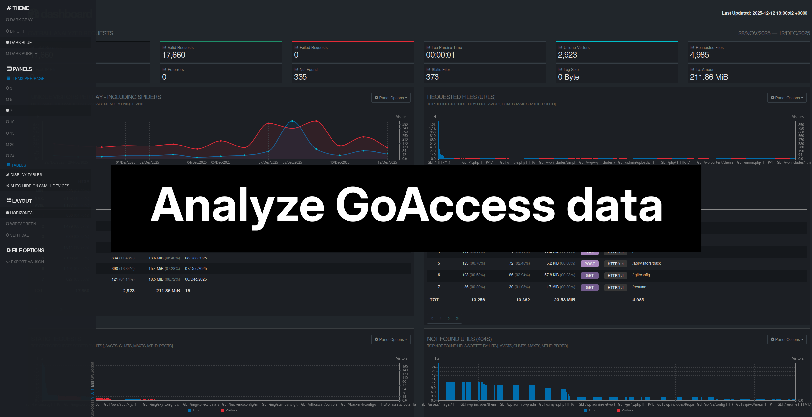
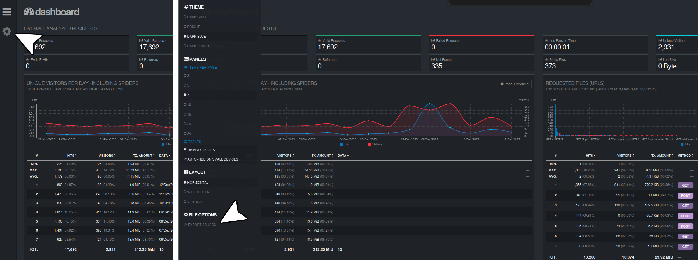

# Analyze data from GoAccess

This folder has a [notebook](./analyze_nginx_logs.ipynb) and scripts to help you look at and visualize data exported from [GoAccess](https://goaccess.io/). GoAccess is a free tool that lets you check your web server logs in real time, either in the terminal or in a web browser.



## Export data from GoAccess

To use the scripts and notebook in this folder, you need to export your GoAccess data as a JSON file. You can do this from the GoAccess HTML dashboard by clicking the gear icon, then choosing Export options > JSON, and saving the file.



You can also export the data using the command line. Just run the command below, replacing `access.log` with your log file and `output.json` with the name you want for the output file:

```bash
goaccess access.log -o output.json --log-format=COMBINED
```

Put the JSON file you exported into this folder to use it with the notebook and scripts.

## Install dependencies

To run the notebook and scripts, you need to install some Python packages. All required packages are listed in the `requirements.txt` file in this folder.

First, create a virtual environment:

```bash
# With Anaconda
conda create -n goaccess_analysis python=3.13
conda activate goaccess_analysis

# Or with venv
python -m venv goaccess_analysis
source goaccess_analysis/bin/activate  # On Windows: goaccess_analysis\Scripts\activate
```

Then, install the dependencies:

```bash
pip install -r requirements.txt
```

## Usage

Run the [find_bad_actors.py](./find_bad_actors.py) script to find IP addresses that are making too many requests to your server. If you notice anything unusual, you can block those IPs.

Here is an example from my data. You can see that the IP address `45.148.10.246` is making a very high number of requests. This is unusual and could mean that the IP belongs to a bad actor.

```text
IP Address           Hits       % of Traffic   
---------------------------------------------
45.148.10.246        5542       32.33          
xx.xxx.xx.xxx        488        02.85          
xx.xxx.xx.xxx        370        02.16 
```

The [analyze_nginx_logs.ipynb](./analyze_nginx_logs.ipynb) notebook gives you a deeper look at your GoAccess data. The notebook is organized into sections, so you can easily jump to the parts you are most interested in.

## Issues

If you run into any problems or have questions, feel free to open an issue in this repository. I'll do my best to help you out!
