## Introduction

[Planetarium](https://en.wikipedia.org/wiki/Planetarium_software) applications helped me learn a lot about the universe. I read stories about [constellations](https://en.wikipedia.org/wiki/Constellation), stars, and planets. I memorized the names of the brightest stars. I learned how to read astronomical data like [right ascension](https://en.wikipedia.org/wiki/Right_ascension), [declination](https://en.wikipedia.org/wiki/Declination), [magnitude](<https://en.wikipedia.org/wiki/Magnitude_(astronomy)>), [star type](https://en.wikipedia.org/wiki/Stellar_classification), etc.

I use planetarium applications on both my phone and my computer. Some are free, others are paid. Some are simple, others are complex. Overall, I believe everyone should have a planetarium app at hand. In this article, I will share with you the free applications that I have used over the past years.

## Computer applications

### Stellarium

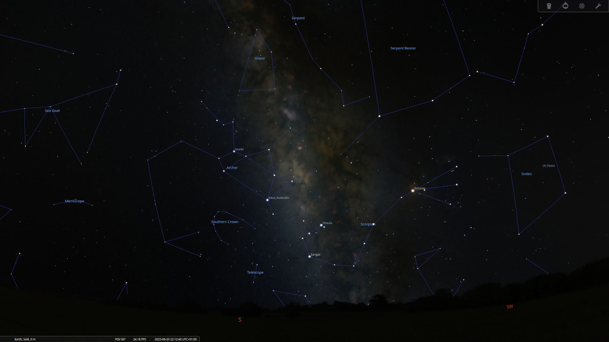

[Stellarium](https://stellarium.org/) was the first planetarium application I used. I installed it on my Ubuntu computer after discovering that it is free and open source. I don’t remember exactly how I found it, but I think it was through a YouTube video about astronomy.

Stellarium has a simple, intuitive user interface and is packed with features. It is my favorite application, and I’d like to share some of the features I really enjoy.

#### Object information

Clicking on any object, whether it is a star, planet, galaxy, or something else, displays a lot of information about it. You can see details such as its magnitude, distance, position in the night sky, and many other useful facts.

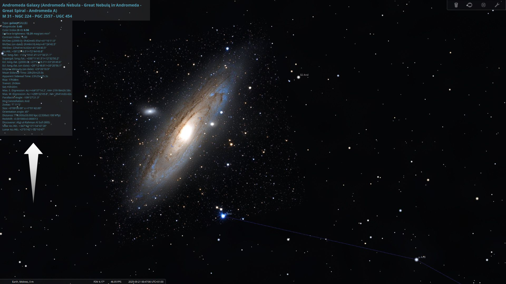

#### What's up today

The `What's up today` feature shows you a list of interesting celestial events happening on the current day, such as planets, galaxies, and comets. It's a great way to discover new objects to observe in the night sky.

To access this feature, click on the `Astronomical calculations window` icon on the left toolbar or press `F10`, then go to the `What's up today (WUT)` tab.

Within the `WUT` tab, you can filter events by category (for example, planets or comets) and by the time of day (such as any time during the night or just in the evening). You can also filter the results by magnitude, which is useful if you want to see only the brightest objects.

The results appear in the `Matching objects` table. You can double-click any row to center the view on that object.

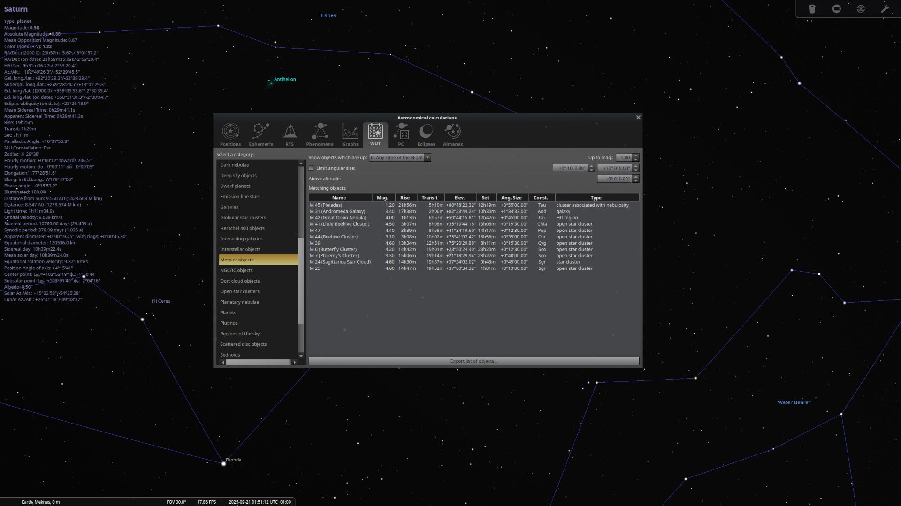

#### Phenomena

The `Phenomena` feature allows you to calculate when certain celestial events will occur between two objects. By default, the tool calculates only [conjunctions](<https://en.wikipedia.org/wiki/Conjunction_(astronomy)>), but you can also select [oppositions](<https://en.wikipedia.org/wiki/Opposition_(astronomy)>), [elongations](<https://en.wikipedia.org/wiki/Elongation_(astronomy)>), [quadratures](<https://en.wikipedia.org/wiki/Quadrature_(astronomy)>), [perihelion](https://simple.wikipedia.org/wiki/Perihelion), and [aphelion](https://simple.wikipedia.org/wiki/Aphelion).

Before starting the calculation, choose the start and end dates, the two objects, the type of phenomena you want to calculate, and the maximum allowed separation. Then click the `Calculate` button.

Double-clicking any row in the results table will take you to that event in time and center the objects in the view.

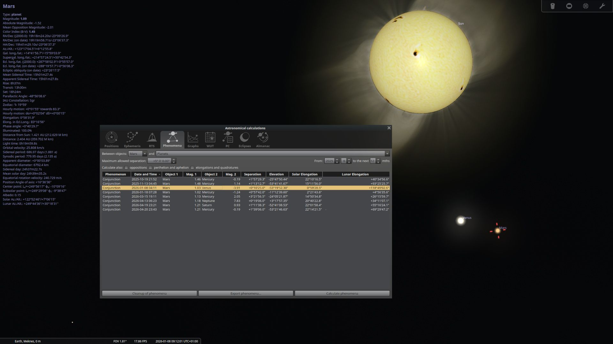

#### Eclipses

The `Eclipses` feature allows you to calculate all types of eclipses, including lunar, solar, and planetary transits. By default, the `All solar eclipses` tab is selected, but you can choose any type of eclipse from the tabs at the bottom. Select the starting year and the number of years you want to search, then click the `Calculate eclipses` button.

As with the previous features, double-clicking any row in the results table will take you to that event in time and center the relevant objects in the view.

#### Image sensor frame

For astrophotographers, the `Image sensor frame` feature is extremely useful. It allows you to simulate the field of view of your camera and telescope setup, so you can see exactly what portion of the sky will be captured in your images.

You can select your sensor type, and the tool will display details such as the sensor's dimensions, [binning](https://en.wikipedia.org/wiki/Pixel_binning), X and Y scale, and rotation angle. You can also choose your telescope and lens configuration, including [focal reducers](https://en.wikipedia.org/wiki/Telecompressor) or [extenders](https://en.wikipedia.org/wiki/Extension_tube), and see the resulting field of view and multiplicity.

This makes it easy to plan your [astrophotography](https://en.wikipedia.org/wiki/Astrophotography) sessions and ensure your target fits perfectly within your camera's frame.

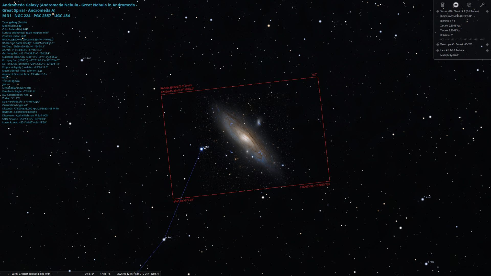

#### Sky culture

Stellarium supports a variety of [sky cultures](https://en.wikipedia.org/wiki/Cultural_astronomy), allowing you to view the night sky as interpreted by different cultures around the world. You can choose from a wide range of cultural sky representations.

To explore these options, click on the `Sky and viewing options window` icon on the left toolbar or press `F4`, then go to the `Sky culture` tab.

#### Simulating sky conditions

In the past, [people enjoyed the night sky](https://harmoniouscosmos.com/ancient-astronomies-and-the-human-fascination-with-the-sky/) without the effects of [light pollution](https://en.wikipedia.org/wiki/Light_pollution). Today, in most cities, it is difficult to see more than a few stars due to artificial lights, which means we miss out on much of the sky’s beauty.

Stellarium allows you to simulate different sky conditions, such as light pollution, and atmospheric effects. This is especially useful for planning observations based on your local environment.

To adjust these settings, click on the `Sky and viewing options window` on the left toolbar or press `F4`, then go to the `Sky` tab.

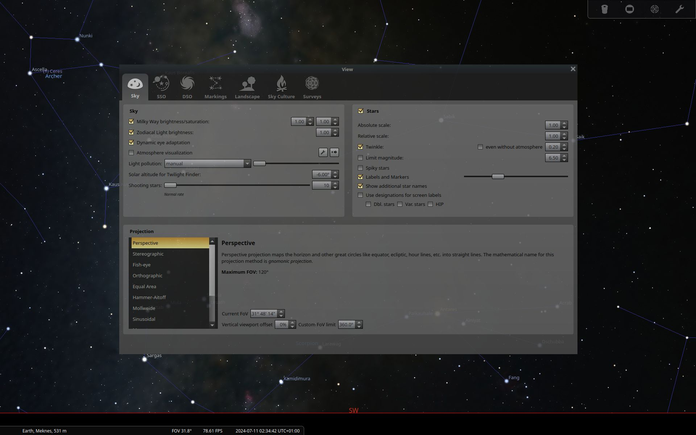

To control whether the atmosphere is rendered, check the `Atmosphere visualization` checkbox. For more options, click the ::fa{fa-solid fa-wrench}:: icon next to it to adjust temperature, pressure, and other parameters.

 and without atmosphere (right).")

To simulate light pollution, use the slider in the `light pollution` section. This slider lets you change the [Bortle scale](https://en.wikipedia.org/wiki/Bortle_scale) from 1 (excellent dark sky) to 9 (inner city sky). Move the slider to see how the sky changes under different conditions.

 and a Bortle 9 sky (right).")

You can also adjust other settings, such as making stars twinkle, changing the [sky projection](https://en.wikipedia.org/wiki/General_Perspective_projection), and modifying the [field of view (FOV)](https://en.wikipedia.org/wiki/Field_of_view).

#### Plugins

Because Stellarium is open source, it offers a wide range of plugins that add extra features to the application. You can find plugins that add [quasars](https://en.wikipedia.org/wiki/Quasar), [pulsars](https://en.wikipedia.org/wiki/Pulsar), simulate periodic [meteor showers](https://en.wikipedia.org/wiki/Meteor_shower), and much more.

To explore plugins, click on the `Configuration window` icon on the left toolbar or press `F2`, then go to the `Plugins` tab. Select a plugin and check the `Load at startup` box to enable it. Some plugins have additional settings you can configure by clicking the `Configure` button.

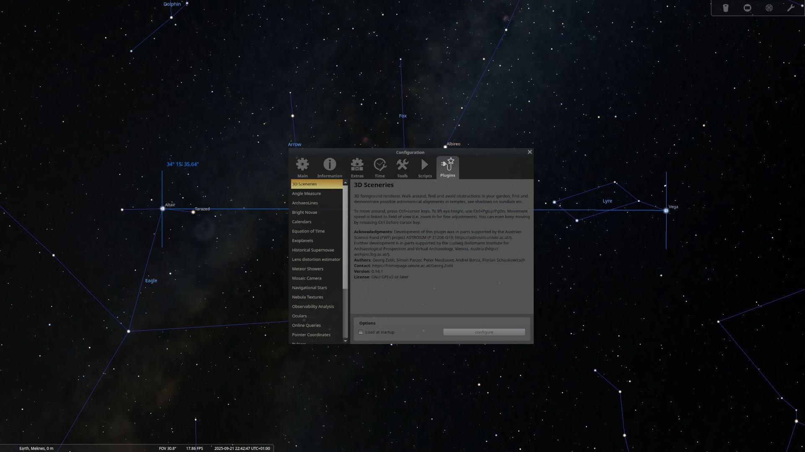

For example, I enabled a plugin that measures [angular distances](https://en.wikipedia.org/wiki/Angular_distance) between objects in the sky. After restarting Stellarium, I could use this plugin by clicking on the `angular distance measurement tool` on the bottom toolbar.

#### Full guide

I could write about Stellarium all day, but I will stop here. If you want to learn more about Stellarium and its features, I recommend checking out the [official Stellarium guide](https://stellarium.org/files/guide.pdf). It is a complete resource that covers all aspects of the application.

## Mobile applications

I have used many planetarium applications on my phone over the years. Currently, I only use `Sky Tonight` and `SkySafari Legacy`. Unfortunately, I can't discuss SkySafari Legacy because it is no longer available for download. The other SkySafari versions are paid, and in this article, I only cover free applications that I use.

### Sky Tonight

`Sky Tonight` is a free planetarium application developed by [Vito Technology](https://vitotechnology.com/) and is available on both [Android](https://play.google.com/store/apps/details?id=com.vitotechnology.sky.tonight.map.star.walk&referrer=utm_source%3Dvitosite%26utm_medium%3Dsky-tonight%26utm_campaign%3Dproduct) and [iOS](https://apps.apple.com/us/app/sky-tonight-stargazing-guide/id1570594940). Vito Technology has also developed other applications, such as [Star Walk 2](https://starwalk.space/en), which I used previously. However, since the launch of Sky Tonight, I have switched to it.

I love the graphics and user interface of Sky Tonight. The application has many features that I will discuss below.

#### Calendar

To use the calendar feature, tap the `calendar` icon on the main screen.

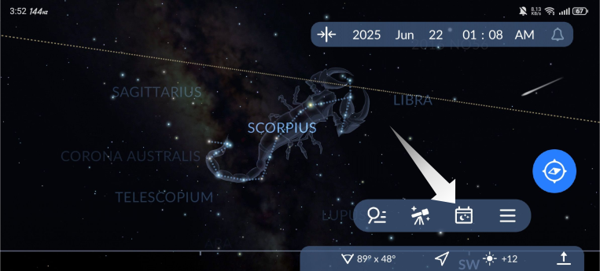

The calendar displays a list of interesting celestial events happening today, and you can also select any future date to see upcoming events for that day. Unlike Stellarium, you can't filter events by category or magnitude, but you can view all events by selecting a date.

The calendar also shows [moon phases](https://en.wikipedia.org/wiki/Lunar_phase). When you tap on a date, you'll see detailed information about the moon phase for that day, including age, illumination, angular size, magnitude, rise and set times, and more.

There is a tab for meteor showers you can observe, and another tab that provides information about the sky, such as the length of the day, total darkness start and end times, and more.

You can also use the `share` button to send calendar information to your friends.

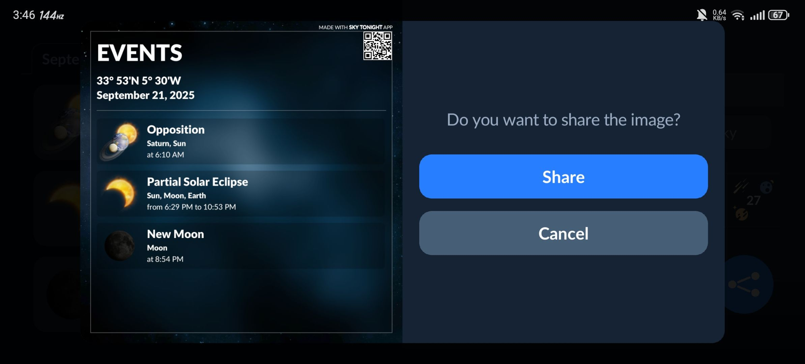

#### Stargazing index

To use this feature, click on the telescope icon at the bottom of the screen in the main view.

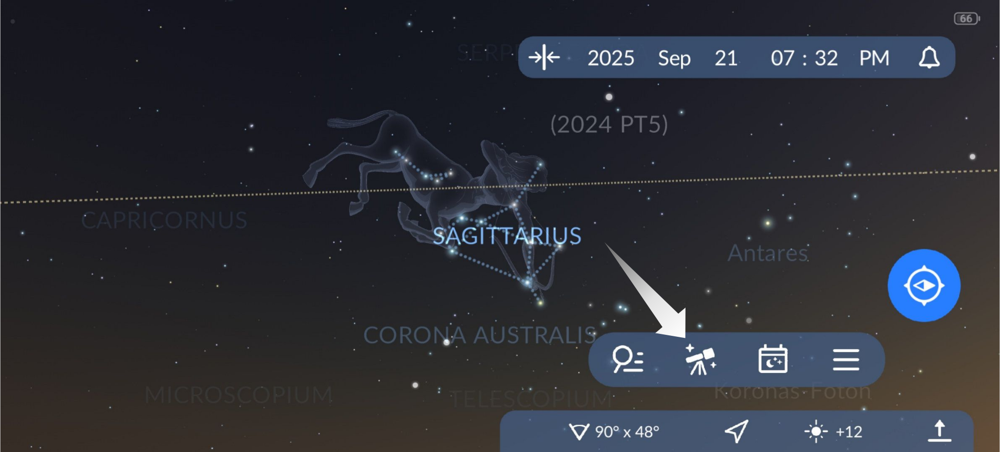

The `Stargazing index` feature gathers information about the start and end of the night, the moon phase, light pollution, and the percentage of cloudiness. All of this data is combined to give you a final score from 0 to 100%. A higher score means better conditions for stargazing.

You can adjust the forecast horizon to see how the stargazing index changes over time. This is helpful for planning your stargazing sessions. You can choose between `1 day`, `3 days`, or `7 days`. When you select 3 days or 7 days, additional tabs appear, one for each day.

#### Stargazing news

The team behind Sky Tonight regularly publishes articles and quizzes about astronomy. You can find these by clicking the hamburger menu icon, then selecting the `Stargazing news` option.

They also create beautiful infographics. I really enjoy reading these articles and taking the quizzes.

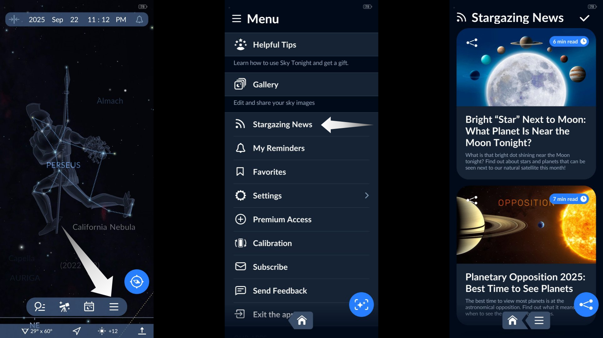

### Other applications

I have also used other planetarium applications like `Star Walk 2`, `SkyView`, and several others. While I no longer use them, they are still solid options. You can try them out and see which one you like best.

## Conclusion

Exploring the night sky is incredibly easy with free planetarium applications. Over time, I’ve tried many of these applications on both my computer and my phone, and each one has taught me something new about the universe.

If you have not already, I encourage you to try some of these tools. You might be surprised by how much you can learn, and how much fun you will have just by looking up.
