## Introduction

In this guide, I'll show you how to photograph [circumpolar star trails](https://en.wikipedia.org/wiki/Circumpolar_star) with your smartphone. The image I used as the thumbnail for this article was taken with my phone under a [Bortle level](https://en.wikipedia.org/wiki/Bortle_scale) 3 sky, just before sunrise.

The Bortle scale is a nine-level scale used by astronomers to describe the brightness of the night sky caused by [light pollution](https://en.wikipedia.org/wiki/Light_pollution).

- **A Bortle 1** sky is extremely dark.
- **A Bortle 9** sky is bright and blocks most starlight.

The image below shows how much `light pollution` affects what you can see in the night sky, from a dark `Bortle 1` location (left) to a bright `Bortle 9` city sky (right).

 and a light-polluted Bortle 9 sky (right).")

By following this guide, you'll learn how to:

- Locate the [north star (Polaris)](https://en.wikipedia.org/wiki/Polaris) or the [south star (Sigma Octantis)](https://en.wikipedia.org/wiki/Sigma_Octantis) to find the center of rotation in the night sky.
- Use your phone's `pro mode` to take long-exposure photos.
- Automatically capture hundreds of photos throughout the night.
- Combine those images into a single image to create star trails.
- Create a [time-lapse](https://en.wikipedia.org/wiki/Time-lapse_photography) video from the same photos (Bonus).

Everything in this article is explained step-by-step, so even if you've never tried astrophotography before, you'll be able to follow along easily.

## Star trails

Star trails are photographs that show the motion of stars across the night sky, which is caused by the Earth's rotation. Capturing a star trail is one of the best ways to get started with [astrophotography](https://en.wikipedia.org/wiki/Astrophotography).

The look of your final image depends entirely on where you point your camera. Each direction creates a different effect:

- **Pointing north or south:** This creates a circular pattern around the celestial poles (Polaris in the north, Sigma Octantis in the south).
- **Pointing east:** You will capture stars as long arcs rising from the horizon.
- **Pointing west:** You will capture stars as long arcs setting toward the horizon.

### Northern hemisphere

If you live in the [northern hemisphere](https://en.wikipedia.org/wiki/Northern_Hemisphere), you can see the star **Polaris**. The Earth's [north celestial pole](https://en.wikipedia.org/wiki/Celestial_pole#Finding_the_north_celestial_pole) is almost perfectly aligned with it, which means **Polaris remains visible all year round** and never sets below the horizon.

Stars that never set below the horizon are called [circumpolar stars](https://en.wikipedia.org/wiki/Circumpolar_star). When you take a photo with Polaris in the center, you capture these circumpolar stars creating perfect circles around it, while other stars form arcs across the sky.


### Southern hemisphere

If you live in the [southern hemisphere](https://en.wikipedia.org/wiki/Celestial_pole#Finding_the_south_celestial_pole), try to locate the star **Sigma Octantis**. If you've never heard of it before, don't worry, I'll show you how to use a planetarium app to help you find any object in the sky.


## Required equipment

To capture a star trail, **you take hundreds of short-exposure images over several hours**. Later, you will combine those images using photo-editing software to create the final star trail effect.

Here is what you will need:

- A tripod.
- Your smartphone.
- An app that can automatically tap the shutter button.
- A planetarium app to help find Polaris or Sigma Octantis.

### Smartphone

Both Android and iPhone users can follow this guide. What matters most is that your camera app allows you to shoot in **pro mode**.

Pro mode lets you change the camera settings manually. This is important because every photo needs to have the same settings throughout the night.

If you don't use pro mode, your phone will keep changing the camera settings on its own while shooting, which will ruin the final image.

In the steps below, I will show you how to find pro mode on your phone. I am using an Android device, but iPhone users should be able to find similar options in their camera app.

Launch your camera app and tap the pro mode option.

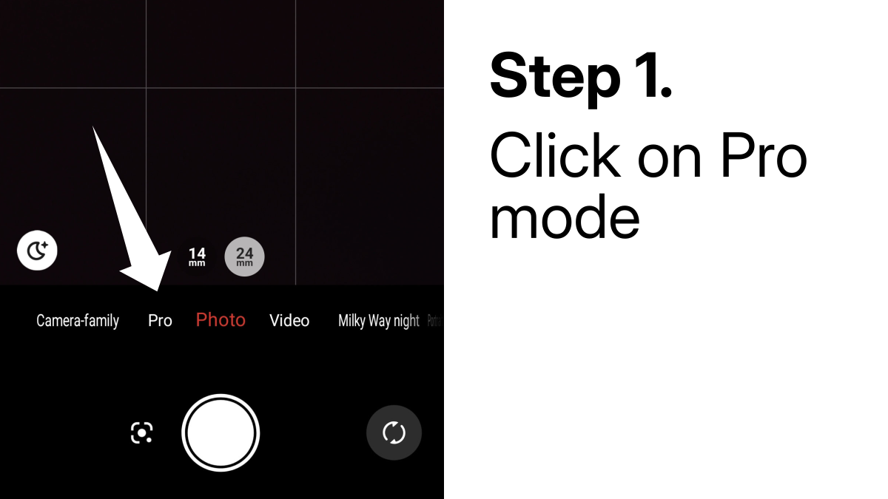

Inside pro mode, you will need to adjust three main settings:

- **ISO:** Controls how sensitive your camera sensor is to light.
- **Shutter speed:** How long the camera's shutter stays open.
- **Focus:** Adjusts the lens to make a specific area in your frame appear sharp and clear.

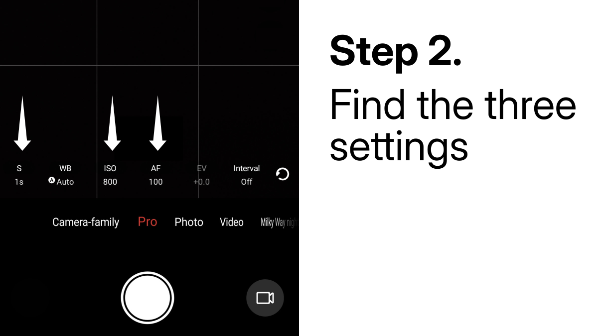

Found them? Great! I'll explain how to set them later in this guide.

### Planetarium app

A planetarium app lets you see the sky directly on your phone. The app uses your location and your phone's compass to accurately show celestial objects.

This guide is written for people in the `northern hemisphere`, where Polaris is visible and easy to find.

If you're in the `southern hemisphere`, Polaris won't be visible. Instead, look for `Sigma Octantis`, the South Star, which is much fainter and harder to spot.

There are many free apps that work on both Android and iPhone. I use [Sky Tonight](https://vitotechnology.com/apps/sky-tonight) every day, it's simple and works well. Give it a try.

Open the app and go through the setup. Once done, click on the `compass icon` in the lower-right corner, or just move your phone around. This helps the app match your view to the real sky.

Keep moving your phone until you see the `south` direction (in the southern hemisphere) or `north` (in the northern hemisphere).


When you're pointing north, Polaris should be highlighted by the app.

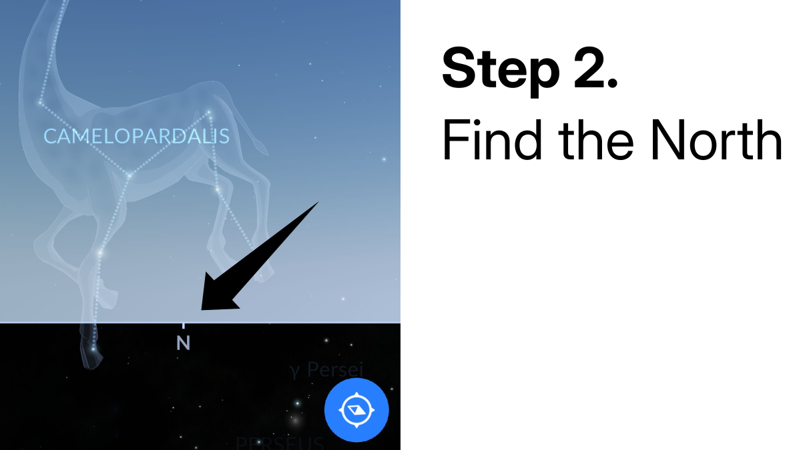

If it's not, tap the **search button**.


Type `Polaris`, then press the locate icon.

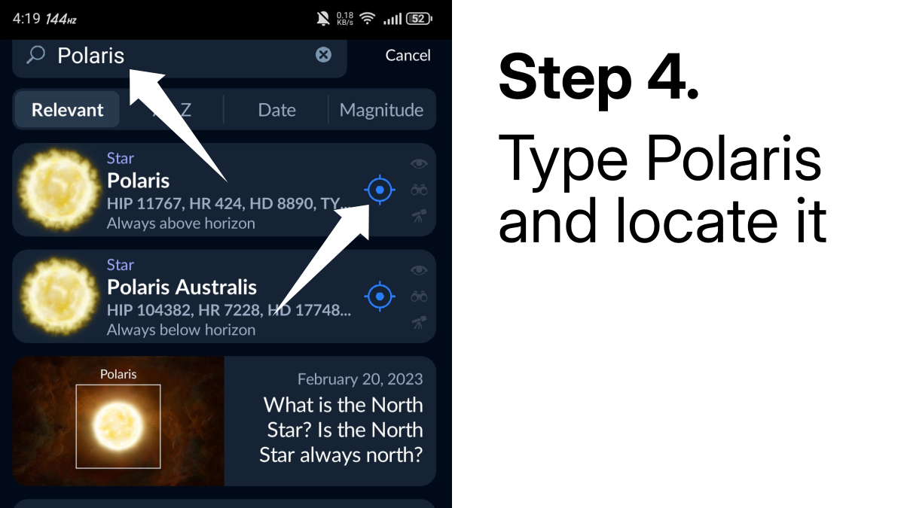

Now you should see Polaris highlighted. Move your phone slowly until the star is in the center of the screen.


### Automatic clicker app

Since you'll be taking hundreds of photos, you need an app that can take them automatically for you. The built-in camera apps on most phones don't have this feature.

On Android, I use [Auto Clicker-Automatic tap](https://play.google.com/store/apps/details?id=com.truedevelopersstudio.automatictap.autoclicker&hl=en-US). It is free, easy to use, and works well. Unfortunately, it's not available for iPhone, but you can find similar apps in the App Store.

Open the app and enable `single target mode`, since we only need to tap one thing, the shutter button.


Make sure the control panel is showing on screen.


You can disable this mode now, I will show you how to use it properly later.

### Tripod

To get a clean star trail, your phone must stay completely still during the entire shoot. That's why a tripod is important.

Any tripod that can hold your phone will do. No need to spend a lot, even a cheap one works fine.

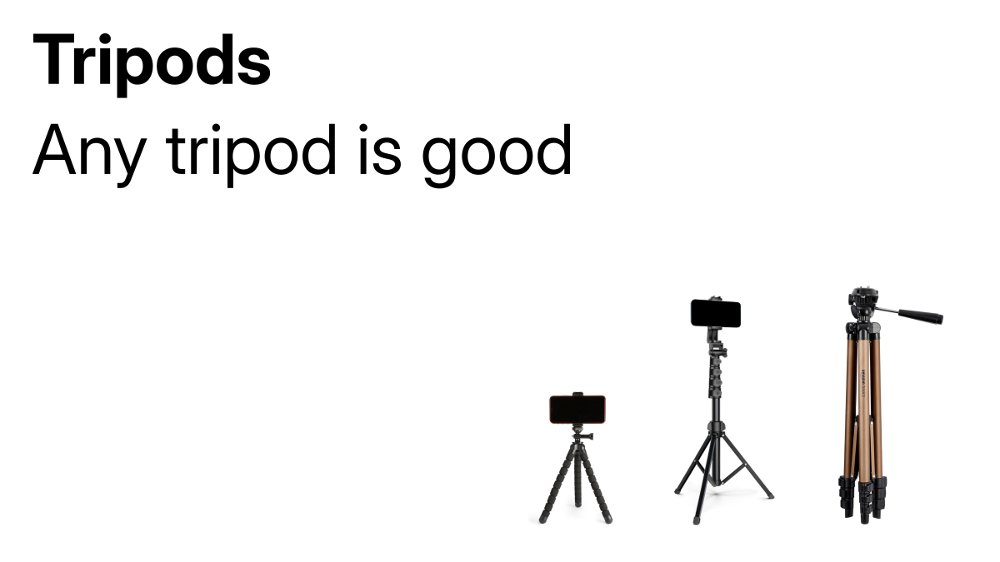

If you don't have a tripod, you can lean your phone against a wall or somewhere solid that won't move. I have done this many times when I couldn't afford a tripod :)

## Collecting data

Place your smartphone on the tripod. Then, open the planetarium app you downloaded. Search for the star Polaris and follow it until you find it. Try to center it in the screen, or put it in a corner if you prefer.

Make sure the phone stays still all night. If it is windy, cover the phone gently, but don't block the camera lens.

Now, open the auto clicker app and turn on `single target mode`.

Exit the auto clicker, then open the camera app. Switch to `pro mode`, and place the auto clicker's floating blue circle over the shutter button.

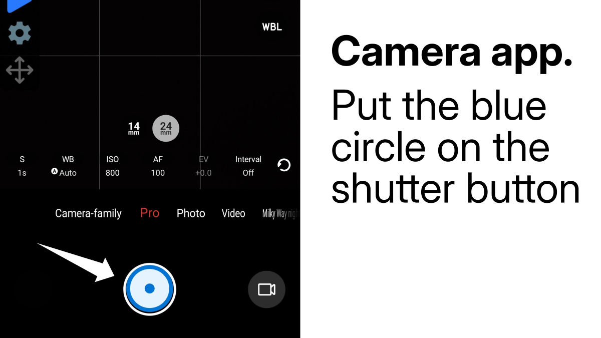

Now, it is time to adjust the settings. First, tap on `AF` and set it to **infinity**. This locks the camera focus on distant stars. If you skip this, the camera will try to focus on something nearby, and your photos will be blurry.


Now, tap `S` (it might say something different depending on your app) to change the shutter speed. Set it to 10 seconds. That means the camera stays open for 10 seconds each time, gathering as much light as possible.

Don't go over 20 seconds, especially if you're using a tripod. If you set it too high, stars will show up as streaks, not circles. Try taking a test shot at 30 seconds just to see what happens. You'll see that the stars are all stretched.

So stick to 10–20 seconds. For now, use 10.

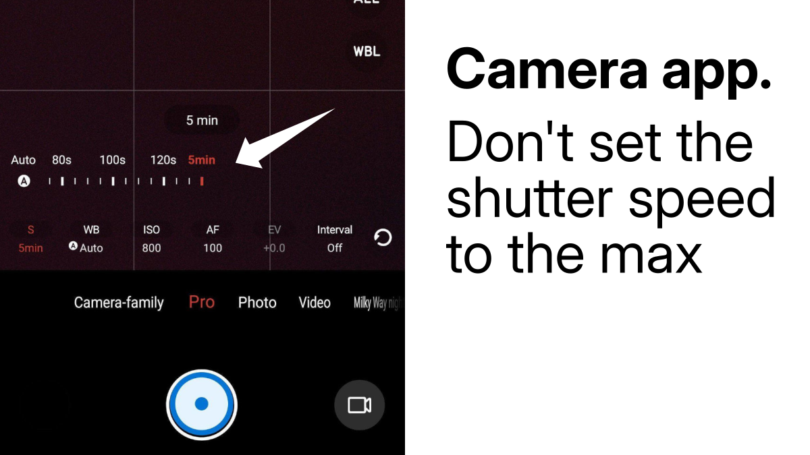

Next, tap the `ISO` button and set it between 800 and 1600. If you're in a city with light pollution, keep it at 800 or less. Again, don't push the ISO too high, like 25600, unless you want to hurt your eyes later when looking at the photo 😅

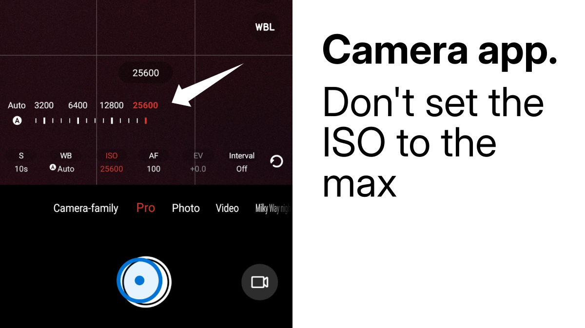

Now, set the timer to 3 or 5 seconds. This helps reduce blur caused by shaking the phone when pressing the shutter. The timer lets the phone settle before taking the shot.


I said it's rare to find an intervalometer built into the camera app. But in my case, it's there. Not sure if all Android phones have it.

If your app has the `Interval` option, set it to 1 or 2 seconds. That means: after a 10-second exposure, the camera waits 1 or 2 seconds before taking the next one.

If your camera app doesn't have this, no problem, we'll use the auto clicker instead. But first, let's take a test shot. Make sure your camera settings are as follows:

- **ISO:** 1200.
- **Timer:** 3 or 5 seconds.
- **Shutter speed:** 10 seconds.
- **Focus:** Infinity (max number).

Take a photo. Open it and check if the stars show up. Here's what I got:

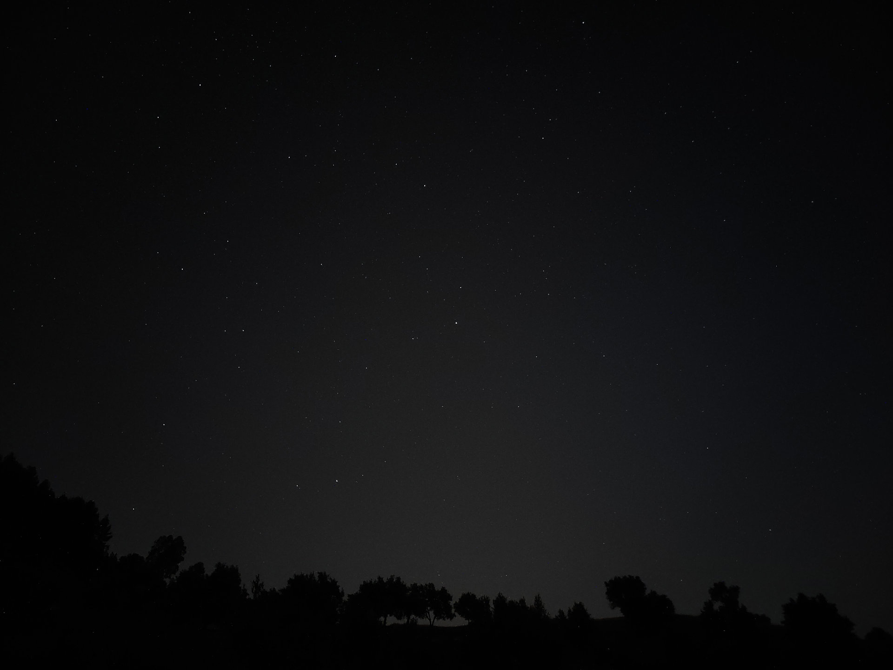

Zoom in on a star. Is it a clean circle? If not, check your focus or increase the timer. If the image is too
dark, increase the ISO a little. Take another photo, look at it, adjust, repeat. Keep doing this until you're
happy with the result.

Once you have found the settings you like, delete the earlier test shots. Now you're ready to let the phone run
on its own and collect data.

Make sure the phone is fully charged before starting. Then, disable Wi-Fi, turn on airplane mode, and set the
phone to silent. This helps prevent interruption, like incoming calls, that could stop the photo sequence.

Put the auto clicker's floating circle on the shutter speed again, and open the settings.

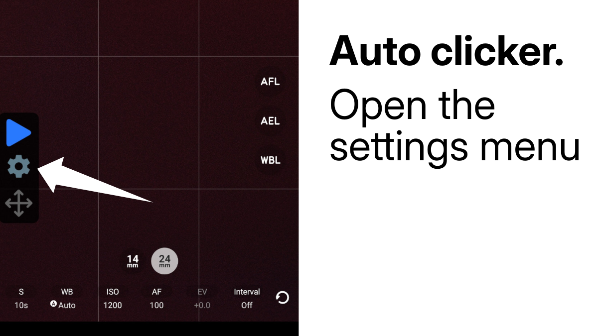

Set the **Stop after** to `Run indefinitely`. Then calculate the interval like this:

```output
Interval = shutter speed + timer + 1 second
Interval = 10 + 3 + 1
Interval = 14 seconds
```

The extra second gives your phone time to save the photo and prepare for the next one. If you want to gain a few
seconds, decrease the timer as much as you can. Once done, click Save.


Now tap the blue icon to start the auto clicker. Don't touch the phone. Leave it alone for 3 to 5 hours.

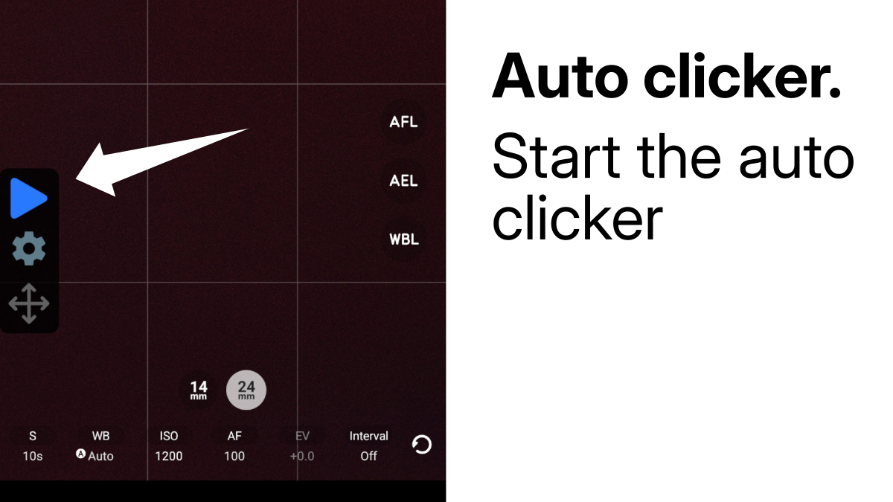

You're done waiting? Good. Tap the same icon again, it is now a square, to stop the auto clicker. If you think
the last photo was affected by you touching the phone, go ahead and delete it.

## Processing the data

### Windows & macOS

You are now ready to process the data you collected. For Windows & macOS users, download the [StarStax program](https://markus-enzweiler.de/software/starstax/). Then connect your phone to your computer with a USB cable and transfer your photos.

Create a folder named `StarTrails` to stay organized. Inside it, create another folder called `images`, and move only your `jpg` files there.

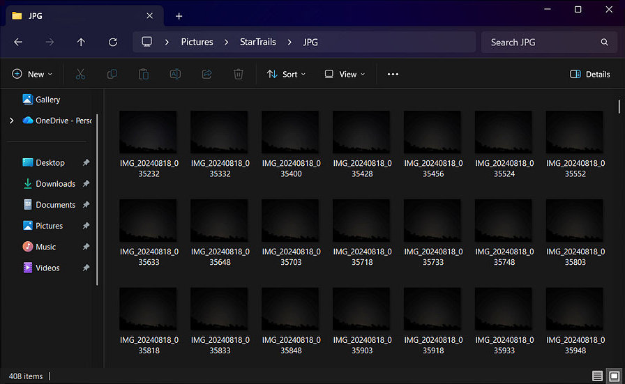

Now, open `StarStax`. Drag and drop all your images where it says "Drop Images Here."


Once the images are loaded, click on a file name to preview it. Every checked image will be used when
stacking. If you notice any with artifacts, simply uncheck them before continuing.

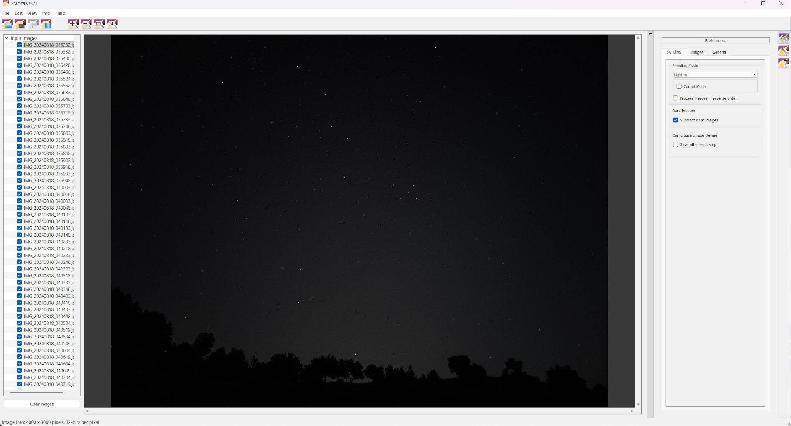

Next, click the `Preferences` button in the top-right corner to open the blending
settings.


By default, `Lighten` mode is selected, this is what we want. You can also select
`Gap filling` to smooth out any breaks in the star trails. Keep
`Lighten` active, then press `Ctrl+P` or click
`Start processing` in the top-left corner to begin stacking.


To save your final image, click `Save as` next to the
`Start processing` button or press `Ctrl+S`.

Inside your `StarTrails` folder, create another folder called
`StackedImage` and save the result there.

Before saving, make sure to add the correct file extension. If you just want the final image, use
`.png` or `.jpg`. If you plan to edit it further, for example, to
remove satellites or add effects, save it as `.tiff`.


### Linux

There's an excellent open-source project on GitHub called [startrails](https://github.com/gkyle/startrails). It lets you stack images, remove
artifacts, and fill gaps in your star trails. It's completely free and open source.

On GitHub, click on the `Code` button and download the project as a ZIP file.


Unzip the file and navigate to the project folder using these commands:

```bash
cd Downloads
cd startrails
```

To start the program, run this script:

```bash
./run.sh
```

Now wait, the script will create a virtual environment using the
[uv package manager](https://docs.astral.sh/uv/). If you have an **NVIDIA GPU**,
the script will automatically detect it and install the required dependencies to use your GPU for faster
processing.

At the end of the installation, you should see this window:


Click on the `Add star frames` button and import your images.

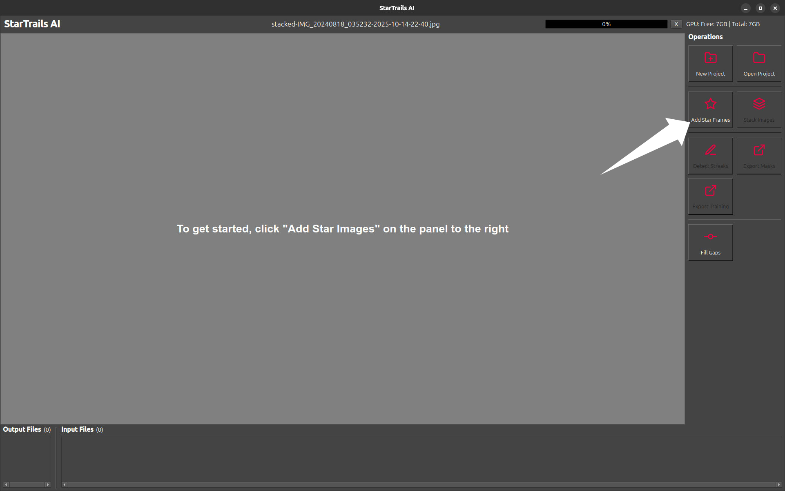

After loading the images, you will be able to preview the images in the app.

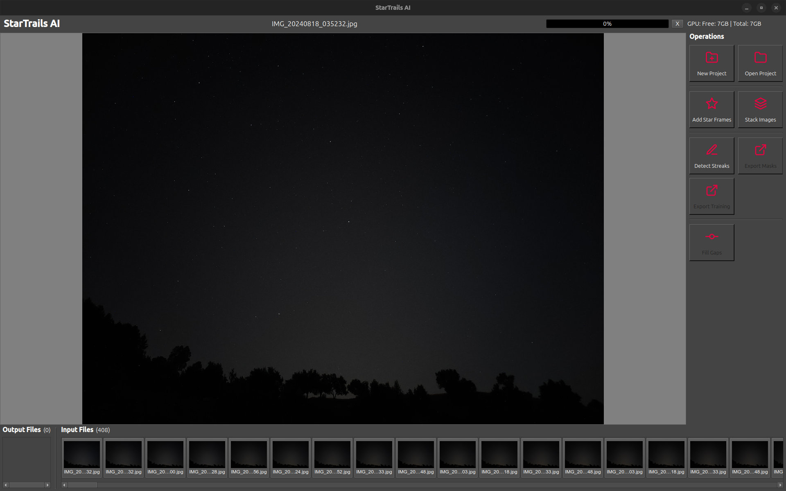

Next, click `Stack images` to start the stacking process. In the options, set
`Fade Frames` to None. If you have a GPU, enable it and adjust the
`Batch Size` based on your GPU's available VRAM.

Higher batch sizes will speed up processing but also use more memory. Click `OK` to start
the stacking process.

The final image will be saved in the `projects` folder:

```bash
cd Downloads/startrails/projects/
tree default.project/
```

Output:

```output
default.project/
├── stacked-IMG_20240818_035232-2025-10-14-22-40.jpg
└── stacked-IMG_20240818_035232-2025-10-14-22-47.jpg
```

To fill gaps in the star trails, click the `Fill gaps` button. The result will be saved in
the same folder.

You can also remove satellite streaks from the images by clicking on the
`Detect streaks` button. This uses a deep learning model to find and remove streaks
automatically.

Click `Stack images` again. Choose `Remove` in the streaks section and
set `Fade frames` to None and click `OK`. Your new image will now be
free of satellite trails.


## Bonus: Time-lapse

Here is a bonus for you, with the same data, you can create a time-lapse like this one.

::: video ./timelapse_60_fps.mp4 "Time-lapse of the night sky."
:::

To do this, you'll need video editing software to combine your images into a video. I use
[Shotcut](https://www.shotcut.org/), but feel free to use any other program you like.

### StarStax

In StarStax, enable the `Save after each step` option. Enter a name in the
`image name` field, this will be used as a prefix for each frame. Then click
`Browse` to select where the images should be saved.

Create a new folder inside `StarTrails` and call it `Timelapse`.
Inside it, create another folder named `Images`.

Select the `Images` folder when clicking on `Browse`.


If you downloaded [Shotcut](https://www.shotcut.org/), follow these steps.
Otherwise, try to reproduce them in your own editing software.

Open Shotcut and go to `Settings` → `Video mode` →
`Custom` → `Add` to create a new video mode.


Set the resolution and aspect ratio based on your phone camera's resolution. Set the frame rate to
**30 or 60 FPS**, then click **OK**.


Drag your first image (for example, `image_name_00000000`) into Shotcut. Then open the
`Properties` panel and check `Image sequence`, this tells Shotcut to
combine all the images into a single video.

Press the `+` button or the `A` key to add the video to the track.


Click `Export` → `Advanced`, and make sure the format is
`MP4`. Check that the resolution and FPS match your project settings. Finally, click
`Export file` to create your time-lapse.

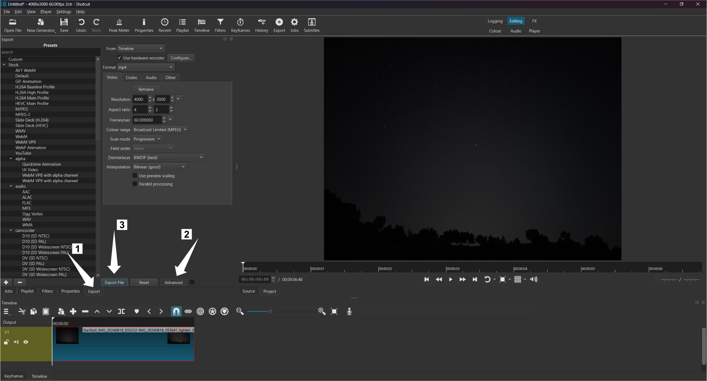

## Conclusion

In this guide, you learned how to use **pro mode** on your camera app to control every setting manually.

You used an **auto clicker** to capture images automatically throughout the night, and learned how to use
computer programs to **stack** those images into a single star trail, and even how to turn them into a
**time-lapse** video.

Everything you've learned here also applies to digital cameras.

Happy stargazing!
