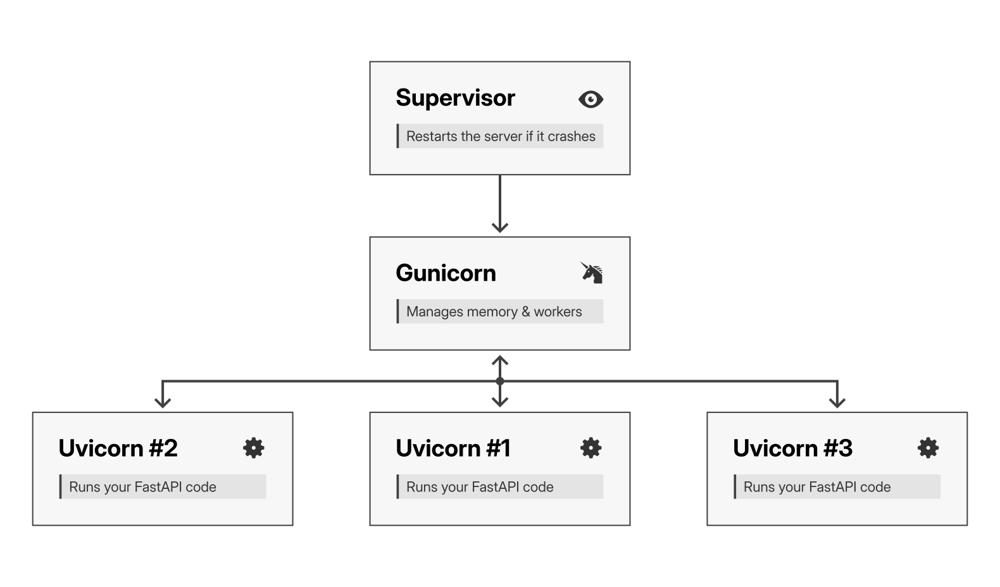

## Introduction

In this article, you will move your codebase to the cloud, install the necessary runtimes (Python and Node.js), and configure a process manager to keep your backend alive.

## Move the project to the VM

You will be deploying a full-stack application that uses **Vue.js** for the frontend and **FastAPI** for the backend.

To follow this guide exactly, your project should have a structure similar to mine. You can find the full source code for my website here: [https://github.com/ImadSaddik/ImadSaddikWebsite](https://github.com/ImadSaddik/ImadSaddikWebsite).

::: info Note
The goal here isn't to deploy my specific website on your server, but to use this repository as a reference or a practice dummy if you don't have your own app ready yet.
:::

The folders you need to focus on are:

- `/backend`: Contains the API code and `requirements.txt` for the `Python` dependencies.
- `/frontend`: Contains the `Vue.js` source code and `package.json` for the `Node.js` dependencies.

If your project uses a different structure or stack, please adjust the file paths in the commands below accordingly.

### Compress and upload the code

On your local machine, create a compressed archive of your project to speed up the transfer. Run this command inside your project folder:

```bash
tar -czvf source_code.tar.gz --exclude='node_modules' --exclude='venv' --exclude='__pycache__' --exclude='.git' .
```

::: info Note
The `.` at the end means "compress everything in the current directory". You can replace it with a specific folder or file if you only want to compress part of your project.

We exclude `node_modules` and `venv` because they contain large files that can be easily recreated on the server. The `__pycache__` and `.git` folders are also unnecessary for deployment.
:::

Now, send the file to your VM using the `scp` ([secure copy](https://en.wikipedia.org/wiki/Secure_copy_protocol)) command.

```bash
scp source_code.tar.gz <your_username>@<your_server_ip>:/tmp/
```

::: info Note
We upload to `/tmp/` first because your user might not have permission to write directly to the final destination yet.
:::

Connect to your VM and verify that the file arrived safely.

```bash
ssh <your_username>@<your_server_ip>

ls /tmp/source_code.tar.gz
```

### Organize the project files

You might be tempted to put your project inside your home directory (`/home/<your_username>`). While that works for development, best practice for production is to use a neutral location like `/var/www` or a dedicated folder like `/web_app`.

This approach keeps your application logic separate from your personal user files (`.ssh`, `.bash_history`) and prevents permission issues if you ever modify your user account.

Create the dedicated folder:

```bash
sudo mkdir /web_app
```

Move the compressed file into this new folder and extract it.

```bash
sudo mv /tmp/source_code.tar.gz /web_app/
cd /web_app
sudo tar -xzvf source_code.tar.gz
```

Verify that your files are extracted correctly.

```bash
ls
# Output: README.md ...
```

Currently, these files are owned by `root` (because you used sudo). Change the ownership to your user account so you can manage the files without needing `sudo` for every minor change.

```bash
sudo chown -R <your_username>:<your_username> /web_app
```

Run this command to check who owns the files now:

```bash
ls -la /web_app
```

Look at the third and fourth columns in the output.

```output
total 44
drwxrwxr-x 7 <your_username> <your_username> 4096 Oct 28 07:20 .
drwxr-xr-x 23 root           root            4096 Oct 28 07:19 ..
...
drwxrwxr-x 6 <your_username> <your_username> 4096 Oct 26 21:37 frontend
```

If you see your username there instead of `root`, the ownership is correct.

While you are here, install the Python tools required for the backend.

```bash
sudo apt install python3-pip python3-venv python3-dev -y
```

## Run the backend

Before you configure the production servers, you need to ensure the application runs properly.

First, move to the backend folder, create a virtual environment named `venv`, and activate it.

```bash
cd /web_app/backend

python3 -m venv venv
source venv/bin/activate
```

Your new virtual environment is currently empty. You need to install the backend packages inside it.

```bash
pip install -r requirements.txt
```

Now, start the backend server for testing. You will use [uvicorn](https://uvicorn.dev/) to run the FastAPI app.

```bash
uvicorn main:app --host 0.0.0.0 --port 8000
```

You should see output indicating that the server has started:

```output
INFO: Started server process [5602]
INFO: Waiting for application startup.
INFO: Application startup complete.
INFO: Uvicorn running on http://0.0.0.0:8000 (Press CTRL+C to quit)
```

### Verify the backend is running

You need to verify that your API is alive. First, check if your firewall is active.

```bash
sudo ufw status
```

- **If it says `inactive**`: You are safe to test in the browser, but remember to enable it later for security.
- **If it says `active**`: Great. This means you cannot access port `8000` from the outside, which is what we want.

To test the app through the firewall, open a **new terminal window**, SSH into the server, and run:

```bash
curl http://127.0.0.1:8000/api/health
```

If you see a JSON response (like `{"status": "ok"}`), your backend is working.

Stop the server now by pressing `Ctrl+C` in the first terminal.

## Frontend setup and swap memory

We are using Vue.js for the frontend, which means we need to install [Node.js](https://nodejs.org/en). The best way to install Node.js is with [NVM](https://github.com/nvm-sh/nvm) (Node Version Manager).

Run this command to install NVM:

```bash
curl -o- https://raw.githubusercontent.com/nvm-sh/nvm/v0.40.3/install.sh | bash
```

Your current terminal session doesn’t know about NVM yet. Run this command to load it immediately:

```bash
source ~/.bashrc
```

Now, install the latest LTS (Long Term Support) version of Node.js.

```bash
nvm install --lts
```

You also need [pnpm](https://pnpm.io/) to install the frontend dependencies.

```bash
npm install -g pnpm@latest-10
```

Navigate to the frontend directory and install the dependencies.

```bash
cd /web_app/frontend
pnpm install
```

### The build process and swap memory

Now, try to build the project.

```bash
pnpm run build
```

**Did the build fail?** If you are using a machine with low RAM, this command will likely fail with an "Out of Memory" error or simply say `Killed`. This happens because the build process needs more RAM than the server has available.

You might see the following error:

```output
Building for production...Killed
ELIFECYCLE Command failed with exit code 137.
```

To fix this, you will create a [swap file](https://wiki.archlinux.org/title/Swap). This creates [virtual RAM](https://en.wikipedia.org/wiki/Virtual_memory) using your hard drive space.

Create a 2GB swap file (you can adjust the size if needed, but 2GB is a good starting point).

```bash
sudo fallocate -l 2G /swapfile
```

**What is `/swapfile`?** It is not a directory; it is a single file acting as "virtual RAM". By creating a file instead of a dedicated partition, you can easily resize or delete it later without messing with the hard drive's partition table.

Set the correct permissions:

```bash
# Secure the file so only root can read it
sudo chmod 600 /swapfile
```

Mark the file as swap space and enable it:

```bash
sudo mkswap /swapfile
sudo swapon /swapfile
```

Verify that the swap is active.

```bash
sudo swapon --show
```

Output should show:

```output
NAME       TYPE  SIZE USED PRIO
/swapfile file  2G   0B   -2
```

Here is what this means:

- **TYPE** `file`: Confirms you successfully created a swap file (not a partition).
- **SIZE** `2G`: You have added 2GB of virtual memory.
- **USED** `0B`: This is normal! Linux is smart; it will only start using this slower "fake RAM" once your actual physical RAM is full.
- **PRIO** `-2`: The priority level. Linux uses swap with lower priority than physical RAM.

By default, this swap configuration will be lost when the server reboots. To ensure the swap file loads automatically every time the system starts, you must add it to the [fstab](https://wiki.archlinux.org/title/Fstab) file.

Run this command to append the configuration to the file:

```bash
echo '/swapfile none swap sw 0 0' | sudo tee -a /etc/fstab
```

**Why use `tee` instead of `>>`?** You might wonder why we didn't just use `sudo echo "..." >> /etc/fstab`. That would fail with a "Permission denied" error.

This happens because the redirection (`>>`) is handled by your current shell (which is not root), not by `sudo`. The `tee` command solves this by accepting input and writing it to a file with root privileges.

- `echo '...'`: Creates the text string.
- `|` (Pipe): Passes that text to the next command.
- `sudo tee -a`: Writes the text to the file as root. The `-a` flag stands for append (so you don't overwrite the existing file).

Now that you have extra memory, go back to your frontend directory and try the build command again.

```bash
cd /web_app/frontend
pnpm run build
```

If the build still fails, or if you see a [heap limit error](https://stackoverflow.com/questions/53230823/fatal-error-ineffective-mark-compacts-near-heap-limit-allocation-failed-javas), it means Node.js is restricting itself to a low memory limit, ignoring your new swap space.

This is the error you might see:

```output
FATAL ERROR: Ineffective mark-compacts near heap limit Allocation failed - JavaScript heap out of memory
```

You need to tell Node.js explicitly that it is allowed to use more memory. Run the build command with this specific flag:

```bash
NODE_OPTIONS="--max-old-space-size=2048" pnpm run build
```

Here is what this command does:

- `NODE_OPTIONS`: This environment variable passes arguments to the Node.js process.
- `--max-old-space-size=2048`: This sets the maximum size of the memory heap to 2048MB (2GB). Since you added a 2GB swap file, this ensures Node.js can actually use it.

The build should now succeed. You will see a `dist` folder created.

```output
DONE  Build complete. The dist directory is ready to be deployed.
```

### Verify the frontend build

Let’s verify that the frontend files were built correctly. Go to the `dist` folder.

```bash
cd /web_app/frontend/dist
```

Start a temporary Python web server on port 8080.

```bash
python3 -m http.server 8080
```

If you try to visit `http://<your_droplet_ip>:8080` in your browser, it will fail if you have a firewall blocking everything except SSH.

Instead of opening port `8080` to the entire world (which is insecure), you can use your existing SSH connection to create a [private tunnel](https://iximiuz.com/en/posts/ssh-tunnels/) to the server.

 directly to the server's internal localhost (port 8080), effectively bypassing the remote firewall.")

Think of it like a secure pipe inside your existing SSH connection:

1. Local end: You open port `8080` on your laptop (`localhost`).
2. The tunnel: SSH encrypts any traffic you send to that port.
3. Remote end: SSH delivers that traffic to `localhost:8080` on the server, just as if you were sitting right in front of it.

Open a **new terminal on your local computer** and run this command:

```bash
# Syntax: ssh -L <local_port>:localhost:<remote_port> <username>@<server_ip>
ssh -L 8080:localhost:8080 <your_username>@<your_server_ip>
```

Now, open your browser and visit `http://localhost:8080`. You should see your Vue.js application.


::: info Note
Your app will fail to make any API calls because the backend isn't running properly yet. This is normal. You are just testing if the HTML and CSS load correctly.
:::

When you are done, press `Ctrl+C` in both terminals to stop the SSH tunnel and the Python server.

## Gunicorn and Supervisor

Currently, you are running the backend manually using `uvicorn`. If you close the terminal, the site goes down. To make it production-ready, you need two tools:

- `Gunicorn`: A robust server manager that handles multiple processes.
- `Supervisor`: A system that monitors Gunicorn and restarts it automatically if it crashes or if the server reboots.



Let's configure these tools to keep your backend alive and responsive.

### Install Gunicorn

Navigate to your backend directory and activate the virtual environment.

```bash
cd /web_app/backend
source venv/bin/activate
```

Install Gunicorn inside the environment.

```bash
pip install gunicorn
```

### Create the startup script

You may ask, why do we need both `Gunicorn` and `Uvicorn`?

- `Gunicorn` acts as the **Manager**. It handles the process, creates multiple workers, and ensures they stay alive.
- `Uvicorn` acts as the **Worker**. It runs inside Gunicorn and handles the actual asynchronous events that FastAPI needs.

Create a shell script that tells Gunicorn exactly how to run your application. **Place this script in your backend root folder, not inside the `venv` folder**. The `venv` folder is often deleted or recreated during deployments, so any files inside it are at risk of being lost.

```bash
# Ensure you are in /web_app/backend
nano gunicorn_start
```

::: warning Important
Replace `<your_project_name>` with a name for your app (e.g., `my_blog`) and ensure `USER`/`GROUP` match your username.
:::

```bash
#!/bin/bash

NAME='<your_project_name>'
APPDIR=/web_app/backend
SOCKFILE=/web_app/backend/gunicorn.sock
USER=<your_username>
GROUP=<your_username>
# Increase this if you have more traffic or a more complex app
NUM_WORKERS=3
TIMEOUT=120

# Gunicorn needs to use Uvicorn's worker class for FastAPI
WORKER_CLASS=uvicorn.workers.UvicornWorker

FORWARDED_ALLOW_IPS="*"

echo "Starting $NAME"

cd $APPDIR
source venv/bin/activate

# Create the run directory if it doesn't exist
RUNDIR=$(dirname $SOCKFILE)
test -d $RUNDIR || mkdir -p $RUNDIR

# Start Gunicorn
exec venv/bin/gunicorn main:app \
  --name $NAME \
  --workers $NUM_WORKERS \
  --worker-class $WORKER_CLASS \
  --timeout $TIMEOUT \
  --user=$USER --group=$GROUP \
  --bind=unix:$SOCKFILE \
  --forwarded-allow-ips="$FORWARDED_ALLOW_IPS" \
  --log-level=debug \
  --log-file=-
```

Here is the meaning of the important parts of this script:

#### Identity & Logging

- `NAME`: This gives your process a specific name (like `<project_name>`) so you can easily identify it in system monitoring tools like `top` or `htop`.
- `--log-file=-`: The dash `-` is a special symbol that means "Standard Output". It tells Gunicorn to print logs to the terminal instead of saving them to a file. This allows Supervisor to capture the logs and manage them for us.

#### The Connection (Socket vs. Port)

- `SOCKFILE`: Instead of using a network port (like 8000), you are creating a [Unix Socket file](https://en.wikipedia.org/wiki/Unix_domain_socket). This is a special file that processes use to communicate efficiently. It is faster and more secure than a port because it doesn't open a network connection.
- `--bind`: This tells Gunicorn to listen on the socket file defined in `SOCKFILE` instead of an IP address.
- `FORWARDED_ALLOW_IPS`: We set this to `*` because a reverse proxy (like Nginx) will handle the actual internet traffic in front of Gunicorn. Since that proxy and Gunicorn communicate via a trusted Unix socket on the same machine, we trust the forwarded requests.

#### Workers & Performance

- `NUM_WORKERS`: This decides how many concurrent processes to run. [A good rule of thumb](https://docs.gunicorn.org/en/latest/design.html#how-many-workers) is `(2 x CPU cores) + 1`. Since this is a small server, 3 workers is a safe balance.
- `WORKER_CLASS`: By default, Gunicorn expects a standard Python app ([WSGI](https://en.wikipedia.org/wiki/Web_Server_Gateway_Interface)). Since FastAPI is asynchronous ([ASGI](https://en.wikipedia.org/wiki/Asynchronous_Server_Gateway_Interface)), you must tell Gunicorn to use `uvicorn.workers.UvicornWorker` to bridge the gap.
- `TIMEOUT`: If a worker freezes or takes longer than 120 seconds to respond, Gunicorn will kill it and restart it. This prevents your server from getting stuck on a bad request.

#### System management

- `exec`: This is a bash command that replaces the current shell process with the Gunicorn process. This saves memory because it doesn't leave a useless bash script running in the background while the server runs.

Save the file and exit. Now, make the script executable so it can run as a program.

```bash
chmod +x gunicorn_start
```

### Configure Supervisor

You could run that script manually, but it is better to let **Supervisor** handle it. Supervisor monitors your `gunicorn_start` script, starts it automatically, and immediately restarts it if it ever stops.

First, install Supervisor.

```bash
sudo apt install supervisor
```

Create a folder where Supervisor can save the logs for your application.

```bash
mkdir -p /web_app/backend/logs/
```

Verify that the folder is owned by your user (not root):

```bash
ls -ld /web_app/backend/logs/
```

The output should show your username in the third column:

```output
drwxrwxr-x 2 <your_username> <your_username> 4096 Feb 12 10:30 /web_app/backend/logs/
```

If it shows `root` instead, fix it with:

```bash
sudo chown <your_username>:<your_username> /web_app/backend/logs/
```

Now, create a configuration file to tell Supervisor about your new script.

```bash
sudo nano /etc/supervisor/conf.d/<your_project_name>.conf
```

Paste this configuration:

```ini
[program:<your_project_name>]
command = /web_app/backend/gunicorn_start
user = <your_username>
stdout_logfile = /web_app/backend/logs/supervisor.log
redirect_stderr = true
environment=LANG=en_US.UTF-8,LC_ALL=en_US.UTF-8
```

Save and exit.

### Start the service

Tell Supervisor to read the new configuration and start the program.

```bash
sudo supervisorctl reread
sudo supervisorctl update
```

Check the status to ensure it is running.

```bash
sudo supervisorctl status <your_project_name>
```

You should see `RUNNING` or `STARTING`.

```output
<your_project_name>      RUNNING   pid 26928, uptime 0:00:05
```

Finally, check the log file to verify that the `Uvicorn` workers have started successfully.

```bash
cat /web_app/backend/logs/supervisor.log
```

You should see lines confirming that workers have started and that the application startup is complete.

```output
...
[2025-10-31 06:34:32 +0000] [26928] [DEBUG] 3 workers
[2025-10-31 06:34:36 +0000] [26936] [INFO] Started server process [26936]
[2025-10-31 06:34:36 +0000] [26934] [INFO] Started server process [26934]
[2025-10-31 06:34:36 +0000] [26935] [INFO] Started server process [26935]
[2025-10-31 06:34:36 +0000] [26935] [INFO] Waiting for application startup.
[2025-10-31 06:34:36 +0000] [26934] [INFO] Waiting for application startup.
[2025-10-31 06:34:36 +0000] [26936] [INFO] Waiting for application startup.
[2025-10-31 06:34:36 +0000] [26935] [INFO] Application startup complete.
[2025-10-31 06:34:36 +0000] [26936] [INFO] Application startup complete.
[2025-10-31 06:34:36 +0000] [26934] [INFO] Application startup complete.
```

Test your API again to confirm it is working through the socket.

```bash
curl --unix-socket /web_app/backend/gunicorn.sock http://localhost/api/health
```

The response should be the same as before (e.g., `{"status": "ok"}`), confirming that Gunicorn is running your FastAPI app correctly.

### Verify the socket file

The most important part of this setup is the [socket file](https://askubuntu.com/questions/372725/what-are-socket-files). This is the actual connection point that a reverse proxy (like Nginx) uses. Verify it was created successfully:

```bash
ls -l /web_app/backend/gunicorn.sock
```

You should see the file details, and the first character should be an `s` (indicating a socket file):

```output
srwxr-xr-x 1 <your_username> <your_username> 0 Feb 8 13:00 /web_app/backend/gunicorn.sock
^
```

::: info Note
If the file is missing, the service might have crashed or failed to write to the directory. Check the permissions or logs again.
:::

### Verify the service (and kill zombies)

Check if your process is running correctly using `ps`.

```bash
ps aux | grep <your_project_name>
```

You should see only **one** cluster of processes with a recent start time. However, if you see dozens of processes, or processes with old dates, you have "zombie" workers.

::: info Note
A "zombie" process is a process that has completed execution but still has an entry in the process table. You can learn more about zombie processes here: [https://en.wikipedia.org/wiki/Zombie_process](https://en.wikipedia.org/wiki/Zombie_process).
:::

Here is a real example from my server. Look closely at the start dates:

```output
...
imad       29492  0.1  0.5  67576  2404 ?        S     2025 113:15 ... /web_app/backend/venv/bin/gunicorn main:app --name imadsaddik_com --workers 3
imad       29493  0.1  0.5 143900  2396 ?        Sl    2025 112:49 ... /web_app/backend/venv/bin/gunicorn main:app --name imadsaddik_com --workers 3
imad       29494  0.1  0.4  68252  2332 ?        S     2025 112:55 ... /web_app/backend/venv/bin/gunicorn main:app --name imadsaddik_com --workers 3
imad       60096  0.1  0.5 145088  2448 ?        Sl    2025 108:57 ... /web_app/backend/venv/bin/gunicorn main:app --name imadsaddik_com --workers 1
imad       72474  0.1  0.5 145352  2368 ?        Sl    2025 106:08 ... /web_app/backend/venv/bin/gunicorn main:app --name imadsaddik_com --workers 1
imad       73155  0.1  0.5 144452  2376 ?        Sl    2025 106:00 ... /web_app/backend/venv/bin/gunicorn main:app --name imadsaddik_com --workers 1
imad      324750  0.1  0.5 223440  2444 ?        Sl    Jan01  65:47 ... /web_app/backend/venv/bin/gunicorn main:app --name imadsaddik_com --workers 1
imad      358778  0.1  0.5 223540  2444 ?        Sl    Jan04  61:49 ... /web_app/backend/venv/bin/gunicorn main:app --name imadsaddik_com --workers 1
imad      709363  0.1  0.5 222372  2372 ?        Sl    Jan29  23:23 ... /web_app/backend/venv/bin/gunicorn main:app --name imadsaddik_com --workers 1
imad      783416  0.1  1.0 223324  4788 ?        Sl    Feb04  10:08 ... /web_app/backend/venv/bin/gunicorn main:app --name imadsaddik_com --workers 1
imad      833505  0.0  1.2  38128  5760 ?        S     Feb07   0:17 ... /web_app/backend/venv/bin/gunicorn main:app --name imadsaddik_com --workers 1
imad      833507  0.2  6.9 224996 32732 ?        Sl    Feb07   4:02 ... /web_app/backend/venv/bin/gunicorn main:app --name imadsaddik_com --workers 1
```

I have dozens of processes running simultaneously. Some are from yesterday, some are from last month, and some are even from last year! These are "zombie" workers, orphaned processes running in the background, fighting over the same socket file and eating your RAM.

You might wonder if this actually matters. The answer is yes. Run this command to see exactly how much memory each of these ghosts are stealing. It sorts processes by memory usage:

```bash
ps -eo pid,user,rss,comm | grep gunicorn | awk '{printf "%s %s %0.1fM %s\n", $1, $2, $3/1024, $4}' | sort -k3 -hr
```

The output reveals the cost. While my main process (PID 833507) is using 32MB, the zombies are each chewing up small chunks of memory:

```output
833507    imad     32.0M    gunicorn
833505    imad     5.6M     gunicorn
783416    imad     4.7M     gunicorn
85155     imad     2.4M     gunicorn
704132    imad     2.4M     gunicorn
...
213046    imad     2.2M     gunicorn
```

To see the total damage, run this command to sum up their usage:

```bash
ps -eo rss,comm | grep gunicorn | awk '{sum+=$1} END {printf "Total RSS: %.1fM\n", sum/1024}'
# Output: Total RSS: 110.4M
```

That is **110MB of RAM** wasted on a server that might only have 512MB or 1GB total. This is how servers crash "for no reason".

This usually happens for two reasons:

1. **Manual testing:** You ran the startup script manually to test it, but closed the terminal without killing the process (`Ctrl+C`), leaving it running in the background.
2. **Configuration shifts:** You changed the script (e.g., from 3 workers to 1) but didn't kill the old "3-worker" process before starting the new "1-worker" one.

The quick and easy fix is to kill everything and let Supervisor do its job.

::: warning Warning
This will cause downtime. The command below kills every `Gunicorn` process instantly. Your site will return a `502 Bad Gateway` error for about 5-10 seconds until Supervisor detects the crash and restarts a fresh instance. If you have active users right now, use the safe option instead.
:::

```bash
# Kill every single Gunicorn process
sudo pkill -f gunicorn

# Wait for Supervisor to wake up
sleep 5

# Check again, you should see only fresh processes
ps aux | grep <your_project_name>
```

If you cannot afford 5 seconds of downtime, you must identify the "Good" process tree and kill only the "Bad" ones.

A healthy Gunicorn setup looks like a family tree.

1. **Supervisor** spawns the **Master**.
2. The **Master** spawns **Workers**.

::: tip
In the guide, we set `NUM_WORKERS=3`, so you should see **4 processes** total (1 Master + 3 Workers). In the example below (from my production server), I am using `NUM_WORKERS=1`, so I only see **2 processes** (1 Master + 1 Worker).

The formula: `Total Processes = 1 Master + N Workers`
:::

You want to keep the Master and its children and kill the zombies (orphaned Masters). Ask Supervisor for the PID of the Master process.

```bash
sudo supervisorctl pid <your_project_name>
# Example Output: 833505
```

In this example, 833505 is the "Good Guy" (The Master). Memorize this number.

Run `ps -ef` to view the **Parent Process ID (PPID)**, which reveals the hierarchy of your processes. This command uses two specific flags:

- `-e`: Select all processes.
- `-f`: Display the full-format listing, which includes the PPID and other detailed info.

```bash
ps -ef | grep gunicorn
```

Look at the columns: `PID` (The process itself) and `PPID` (The parent who created it).

```output
UID    PID     PPID    ... CMD
imad   29492   1       ... gunicorn main:app (ZOMBIE - Parent is 1/Init)
imad   60096   1       ... gunicorn main:app (ZOMBIE - Parent is 1/Init)
...
imad   783416  1       ... gunicorn main:app (ZOMBIE - Parent is 1/Init)
imad   833505  833485  ... gunicorn main:app (MASTER - This matches the Supervisor PID)
imad   833507  833505  ... gunicorn main:app (WORKER - Parent is 833505)
```

- **PID 833505**: This matches the PID from Step 1. **KEEP IT**.
- **PID 833507**: Look at its PPID (Parent). It is `833505`. This is a legitimate worker owned by the Master. **KEEP IT**.
- **PID 29492 (and others)**: Look at their PPID. It is `1`. In Linux, PID 1 is the [system init process](https://en.wikipedia.org/wiki/Init). This means their original parent died, and they were "orphaned" to the OS. These are the zombies. **KILL THEM**.

Now that you have visually confirmed the zombies (the ones whose PPID is `1`), you can kill them safely without touching the Master (`833505`) or its Worker (`833507`).

```bash
# Syntax: sudo kill <pid_1> <pid_2> <pid_3> ... <pid_n>
sudo kill 29492 60096 783416
```

::: info Note
Replace `29492`, `60096`, `783416`, etc. with the actual zombie PIDs from **your terminal output**. Do not copy-paste the example numbers; they are only from my server.
:::

Since you are only killing the zombies, the main process continues serving traffic without interruption.

## Conclusion

Your application code is now securely on the server, successfully built, and running. The backend is managed efficiently by Supervisor and listening on a private Unix socket file.

However, no one from the outside world can access it yet. The next step is to install a reverse proxy like Nginx to route traffic to your frontend and proxy API requests securely.
