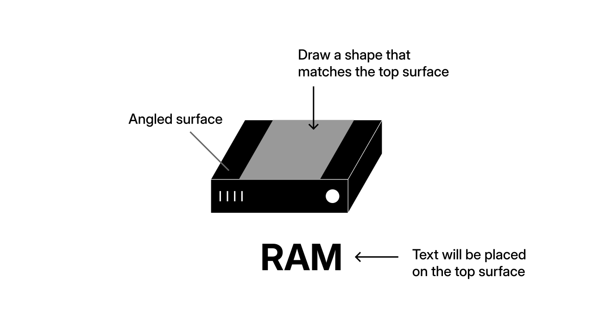
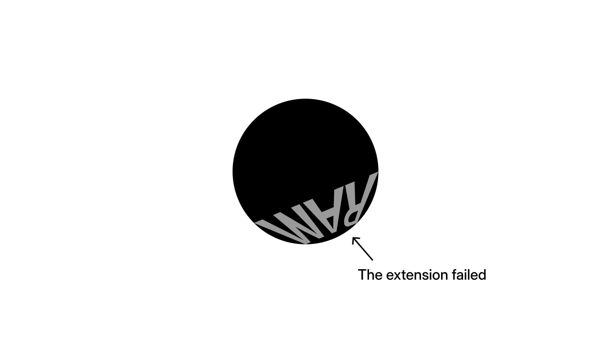
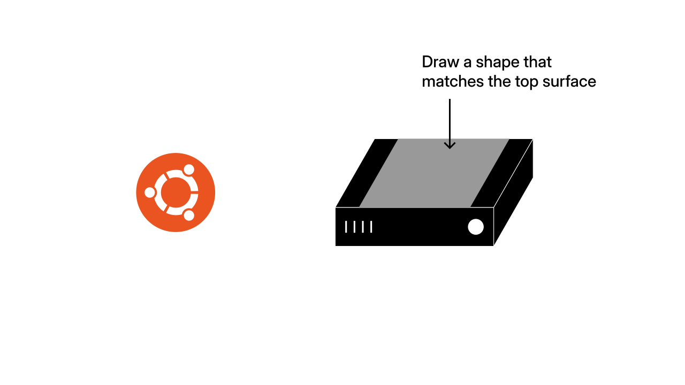
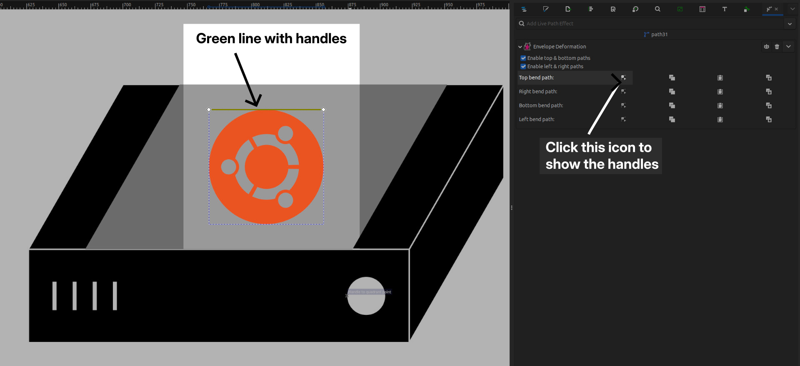
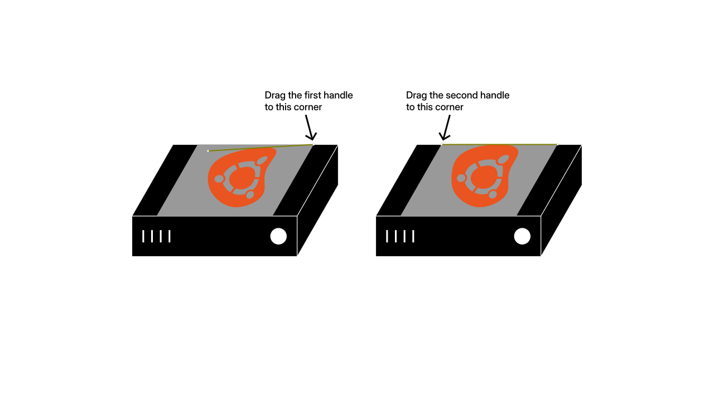
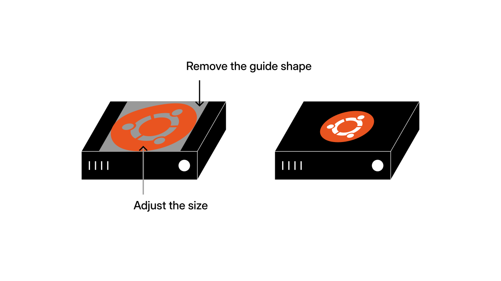

## Introduction

Recently, I wanted to place a logo on a 3D server design, but I ran into a problem. When I pasted the logo on top, it looked flat and fake because it didn't align with the perspective of the surface.

This guide will show you two ways to fix this: one for flat text and one for curved surfaces.

::: youtube [https://www.youtube.com/embed/pFrnlXTtLZU](https://www.youtube.com/embed/pFrnlXTtLZU)
:::

## The problem

When you place a flat 2D design onto a picture of a 3D object, it doesn't account for the perspective. It looks like something floating on top rather than an integrated part of the object.

To fix this, you need to warp your design. However, Inkscape has different tools for this: the **Perspective** extension and the **Envelope Deformation** path effect.

## The solution

Before starting, there is one critical rule: These tools only work on **Paths**. They won't work on editable text or standard imported images.

- **For text:** Select it and press `Shift` + `Ctrl` + `C` to convert it to a path or go to `Path > Object to Path`.
- **For images:** You must trace them first using `Path > Trace Bitmap`.

### The Perspective extension

This method works best on flat, angled surfaces like a wall or a book cover. Draw a shape that matches the surface you want to place your text or logo on.

::: info Note
When drawing the shape, start at the bottom-left corner and move clockwise. This ensures the text orientation remains correct.

However, the drawing order does not matter for logos.
:::

Make sure your text is on top of the shape in the layer order. You can check this in the `Layers` panel (`Shift` + `Ctrl` + `L`). After that, select your text path first, hold `Shift`, and select the target shape second.

::: warning Warning
Make sure that both objects are paths. If they are not, the extension will not work correctly.
:::

Go to `Extensions > Modify Path > Perspective`.

Inkscape will snap the four corners of your text to the corners of the shape.

, but fails with incorrect drawing direction (right).")

As you can see, the text matches the surface angle perfectly, provided it was drawn correctly.

### Envelope Deformation

The Perspective extension falls short on curved surfaces because it creates a linear distortion between corners. For a curved roof or a bottle, you need **Envelope Deformation**.

Select your logo path and open the `Path Effects` panel by pressing `Ctrl` + `&`. Click the arrow icon and search for "Envelope Deformation".

Draw a shape that matches the curved surface you want to place your logo on. This shape will act as a guide for warping. Center the logo over this shape.

Select the logo and make sure that it is on top of the guide shape in the layer order. In the Path Effects panel, you will see options for **Top bend path**, **Right bend path**, etc.

Click the small "Edit on-canvas" <InlineIcon icon="/src/assets/icons/tool_node_editor.svg" /> icon next to the **Top bend path** option. You will see a green line appear with two handles.

Pick one of the green handles and snap it to the corresponding corner of your guide shape. Do the same for the other handle.

Repeat this process for the other sides: **Right bend path**, **Bottom bend path**, and **Left bend path**. Each time, click the "Edit on-canvas" <InlineIcon icon="/src/assets/icons/tool_node_editor.svg" /> icon and snap the handles to the corners of your guide shape.

::: warning Important
This tool creates a "live" effect. To make the shape permanent, select your finished object and go to `Path > Object to Path`.
:::

## Conclusion

You now have two powerful techniques to make your designs fit perfectly onto 3D objects:

- **Perspective** for flat, angled surfaces like walls and book covers
- **Envelope Deformation** for curved surfaces like bottles, spheres, and rounded objects

With these tools, your logos and text will sit naturally within the 3D space rather than floating on top. Remember to convert your text and images to paths first, and always finalize your work with `Path > Object to Path` to lock in your effects.

Happy designing!
