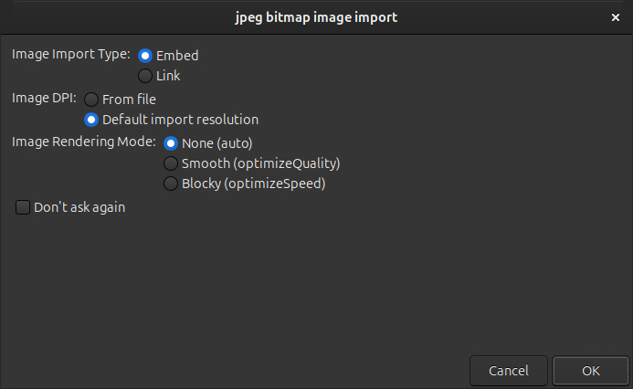

## Introduction

I recently ran into an issue where an Inkscape file I kept reusing grew from just 12KB to over 12MB. The problem was that embedded images remained hidden in the file even after I had deleted them from the canvas.

This guide will show you a simple fix to remove this invisible data to keep your files small.

## The problem

This issue often happens when working with **embedded** [raster images](https://en.wikipedia.org/wiki/Raster_graphics) (like PNGs or JPEGs). When you delete an image from the canvas, Inkscape doesn't always remove the image's data from the SVG file itself.

You won't see the deleted image on your canvas or even in the `Layers and Objects` panel, but the data remains hidden in the file's code, keeping the size unnecessarily large.

If you open the SVG file in a text editor, you will find the image data still there. It is encoded in a format called [base64](https://en.wikipedia.org/wiki/Base64) and looks something like this:

`data:image/png;base64,iVBORw0KGgoAAAANS...`

### Replicate the issue

First, drag a large raster image into your Inkscape document and select `Embed` and `Default import resolution`.

Add another rectangle and try clipping the image using the shape builder tool. Select both the rectangle and the image, then press `X` or click the tool directly. Choose the part of the image you want to keep, and click the `Accept` button to confirm.

Now, save the file and close Inkscape. Check the file size, you should notice it has increased because we added a new image. In my case, it went from 12 MB to 17.5 MB.

Next, open the document again in Inkscape, delete the image, and save the file. Close or minimize Inkscape and check the file size once more. It didn't change, right? That's the problem, the file is still 17.5 MB because Inkscape keeps storing images that are no longer in use.

## The solution

Luckily, there is an easy fix to this issue. Click on `File > Clean Up Document` and save the file. This option removes any unused elements from your document.

Did the file size change? In my case, it shrank to only 12KB. That is a **1458x** reduction.

## Conclusion

As you've seen, the `Clean Up Document` feature removes unused data, such as deleted raster images, that can make your files unnecessarily large.

I hope this guide helps you keep your Inkscape projects clean.
