## Introduction

I wrote this article to document every step I took to replace [ollama](https://github.com/ollama/ollama) with [llama.cpp](https://github.com/ggml-org/llama.cpp), and [llama-swap](https://github.com/mostlygeek/llama-swap). Along the way, I discovered other interesting projects like [whisper.cpp](https://github.com/ggml-org/whisper.cpp), [faster-whisper](https://github.com/SYSTRAN/faster-whisper), and [LibreChat](https://github.com/danny-avila/LibreChat).

This article is long because I show everything in detail. You will learn a lot from this article. You will build `llama.cpp` to run [LLM](https://en.wikipedia.org/wiki/Large_language_model)s, and [multimodal models](https://www.ibm.com/think/topics/multimodal-ai). You will use `whisper.cpp` and `faster-whisper` to run [the whisper model](https://github.com/openai/whisper) from OpenAI.

`llama-swap` is a handy tool that you will use as a middleman between the backend and frontend. The backend is a server that will host the model, and the frontend in our case is `LibreChat`.

In the end, I will show you how to automate everything by using [services](https://wiki.archlinux.org/title/Systemd), [cron jobs](https://en.wikipedia.org/wiki/Cron), creating desktop shortcuts, and using watchers to detect file changes to run commands automatically.

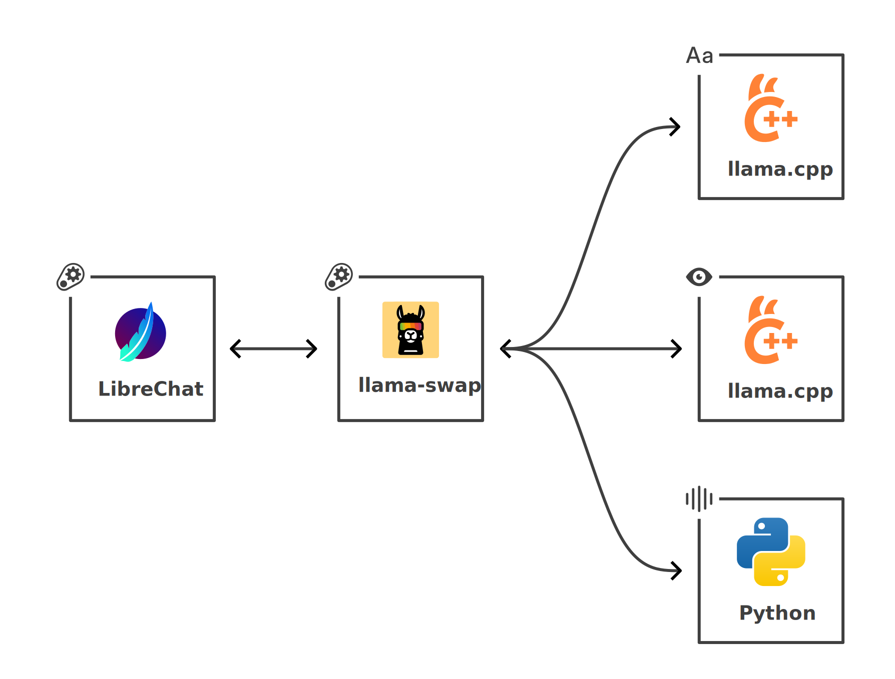

::: warning
Throughout this guide, I use my own username (`imad-saddik`) and specific directory paths (e.g., `/home/imad-saddik/...`) in the code snippets.

You **must** update these paths to match your own username and system file structure. Additionally, check that flags like `-DCMAKE_CUDA_ARCHITECTURES` match your specific GPU model.
:::

## Hardware and operating system

The experiments that I conducted in this article were performed on an **Asus ROG Strix G16 gaming laptop** running **Ubuntu 24.04.2 LTS** with the following configuration:

- **System RAM**: 32GB
- **CPU**: 13th Gen Intel® Core™ i7–13650HX × 20
- **GPU**: NVIDIA GeForce RTX™ 4070 Laptop GPU (8GB of VRAM)

## Installing llama.cpp

The main reason that made me want to try `llama.cpp` is running the new [Qwen3-30B-A3B-Instruct-2507](https://huggingface.co/Qwen/Qwen3-30B-A3B-Instruct-2507) model released by the [Qwen team](https://qwen.ai/home).


Ollama is great, but it decides for you how it should run a model. That worked well for models that didn’t exceed the **12B parameters** range. However, when trying to run big models, ollama complains that I don’t have enough resources to use those models.

For months I was stuck in that situation, I was limited to running only **8–12B parameter** models with ollama. But this weekend, I decided to try `llama.cpp` after hearing people talk about it on Reddit, YouTube videos, and articles.

You have plenty of options to install `llama.cpp`, [refer to the README file on GitHub](https://github.com/ggml-org/llama.cpp/blob/master/README.md). I decided to build `llama.cpp` from source for my hardware. You can [follow the build guide](https://github.com/ggml-org/llama.cpp/blob/master/docs/build.md) that the team behind `llama.cpp` has created.

I have an NVIDIA GPU, I will follow the [CUDA section](https://github.com/ggml-org/llama.cpp/blob/master/docs/build.md#cuda) in the build guide. If you have something else, make sure to follow the section that discusses how to build `llama.cpp` for your hardware.

### Installing build tools

On Ubuntu, run these commands to install the build tools.

```bash
sudo apt update
sudo apt install build-essential cmake git
```

### NVIDIA CUDA Toolkit

You need to install the **NVIDIA CUDA Toolkit** if you don’t have it. This is very important if you want to use your GPU for inference. You can [install the toolkit from NVIDIA’s website](https://developer.nvidia.com/cuda-downloads).

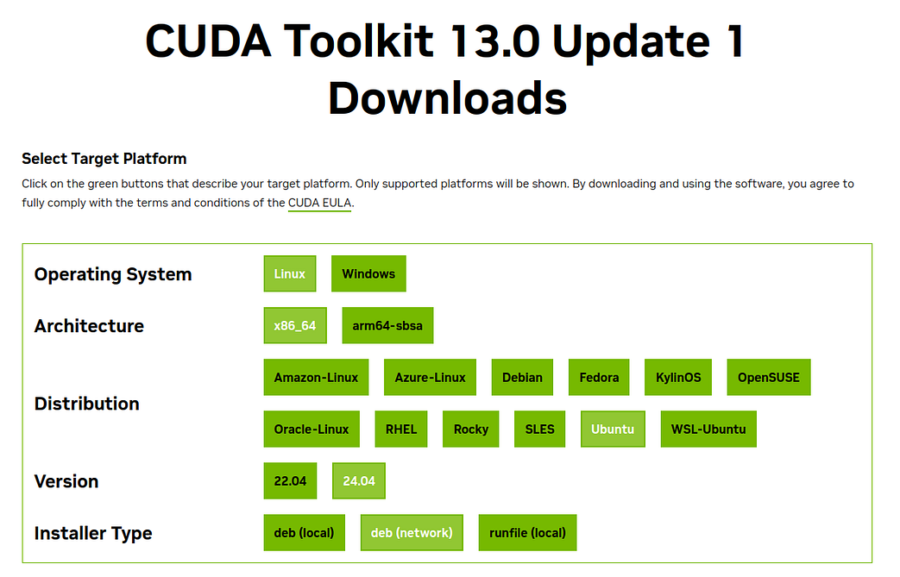

When visiting the website, you will be prompted to select your operating system, architecture, distribution, and other stuff. The options that are selected in the image are valid for my system. Please make sure to select what is valid for you.

For the installation type, you can choose **deb (network)** because it automatically handles downloading and installing all the necessary dependencies.

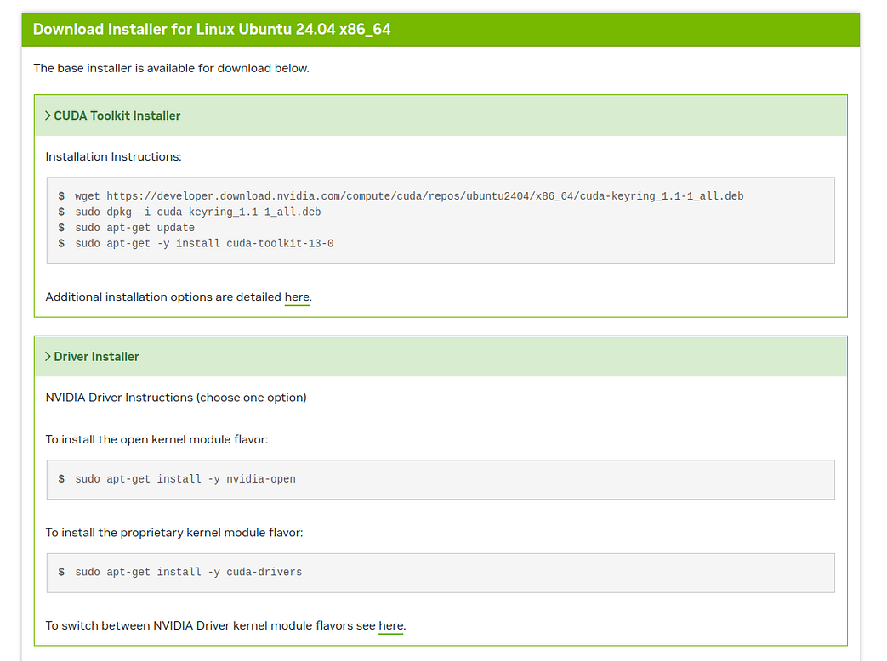

After completing the first step, you will see a list of commands that you need to run in order to install the toolkit. To verify that the installation went well, run this command.

```bash
nvcc --version
```

You should see something like this.

```output
nvcc: NVIDIA (R) Cuda compiler driver
Copyright (c) 2005-2023 NVIDIA Corporation
Built on Fri_Jan__6_16:45:21_PST_2023
Cuda compilation tools, release 12.0, V12.0.140
Build cuda_12.0.r12.0/compiler.32267302_0
```

### Build llama.cpp with CUDA support

Start by cloning the `llama.cpp` project from GitHub with the following command.

```bash
git clone https://github.com/ggml-org/llama.cpp.git
```

Now, go inside the `llama.cpp` folder.

```bash
cd llama.cpp
```

The first command that we need to run is the following.

```bash
cmake -B build -DGGML_CUDA=ON -DCMAKE_CUDA_ARCHITECTURES=89
```

We run the `cmake` command with the `GGML_CUDA=ON` flag to enable support for NVIDIA CUDA so that we can use the GPU for inference.

The `CMAKE_CUDA_ARCHITECTURES` flag tells the compiler exactly which NVIDIA GPU architecture to build the code for. I have an RTX 4070 and the compute capability of this GPU is 8.9. [Visit this page](https://developer.nvidia.com/cuda-gpus) to check the compute capability of your GPU.

After running that command, you should see something like this.

```output
$ cmake -B build -DGGML_CUDA=ON -DCMAKE_CUDA_ARCHITECTURES=89

-- The C compiler identification is GNU 13.3.0
-- The CXX compiler identification is GNU 13.3.0
-- Detecting C compiler ABI info
-- Detecting C compiler ABI info - done
-- Check for working C compiler: /usr/bin/cc - skipped
-- Detecting C compile features
-- Detecting C compile features - done
-- Detecting CXX compiler ABI info
-- Detecting CXX compiler ABI info - done
-- Check for working CXX compiler: /usr/bin/c++ - skipped
-- Detecting CXX compile features
-- Detecting CXX compile features - done
CMAKE_BUILD_TYPE=Release
-- Found Git: /usr/bin/git (found version "2.43.0")
-- The ASM compiler identification is GNU
-- Found assembler: /usr/bin/cc
-- Performing Test CMAKE_HAVE_LIBC_PTHREAD
-- Performing Test CMAKE_HAVE_LIBC_PTHREAD - Success
-- Found Threads: TRUE
-- Warning: ccache not found - consider installing it for faster compilation or disable this warning with GGML_CCACHE=OFF
-- CMAKE_SYSTEM_PROCESSOR: x86_64
-- GGML_SYSTEM_ARCH: x86
-- Including CPU backend
-- Found OpenMP_C: -fopenmp (found version "4.5")
-- Found OpenMP_CXX: -fopenmp (found version "4.5")
-- Found OpenMP: TRUE (found version "4.5")
-- x86 detected
-- Adding CPU backend variant ggml-cpu: -march=native
-- Found CUDAToolkit: /usr/include (found version "12.0.140")
-- CUDA Toolkit found
-- Using CUDA architectures: 89
-- The CUDA compiler identification is NVIDIA 12.0.140
-- Detecting CUDA compiler ABI info
-- Detecting CUDA compiler ABI info - done
-- Check for working CUDA compiler: /usr/bin/nvcc - skipped
-- Detecting CUDA compile features
-- Detecting CUDA compile features - done
-- CUDA host compiler is GNU 12.3.0
-- Including CUDA backend
-- ggml version: 0.9.0-dev
-- ggml commit:  3f81b4e9
-- Found CURL: /usr/lib/x86_64-linux-gnu/libcurl.so (found version "8.5.0")
-- Configuring done (2.6s)
-- Generating done (0.1s)
-- Build files have been written to: /home/imad-saddik/Projects/llama.cpp/build
```

The build files were created. Now, we can build `llama.cpp`. Run this command.

```bash
cmake --build build --config Release -j $(nproc)
```

The command takes the configuration files from the `build` directory and starts the compilation and linking process to create the final program. To speed up the compilation I added `$(nproc)` to use all available CPU cores.

You should see something like this in the end.

```output
$ cmake --build build --config Release -j $(nproc)

...

[ 98%] Built target llama-tts
[ 99%] Linking CXX executable ../bin/test-backend-ops
[ 99%] Built target test-backend-ops
[100%] Linking CXX executable ../../bin/llama-server
[100%] Built target llama-server
```

The compiled programs are now located in the `build/bin/` directory. Let’s copy them to `/usr/local/bin`.

```bash
sudo cp build/bin/llama-cli /usr/local/bin/
sudo cp build/bin/llama-server /usr/local/bin/
sudo cp build/bin/llama-embedding /usr/local/bin/
```

Now, you can run `llama-cli`, `llama-embedding` and `llama-server` directly from any location.

::: info
If you recompile the project, make sure to copy the programs again.
:::

## Running an LLM

Companies and research teams upload their models to [Hugging Face](https://huggingface.co/) in the `safetensors` format.

Search for the [Qwen3-30B-A3B-Instruct-2507](https://huggingface.co/Qwen/Qwen3-30B-A3B-Instruct-2507) model in the hub. Click on the [Files and versions](https://huggingface.co/Qwen/Qwen3-30B-A3B-Instruct-2507/tree/main) tab, notice how many `safetensors` files are there. These files contain the weights in their original high-precision format (16 or 32-bits).


`llama.cpp` does not work with the `safetensors` format, it works with the [GGUF format](https://github.com/ggml-org/ggml/blob/master/docs/gguf.md). This format is optimized for quick loading and saving of models, and running models efficiently on consumer hardware.

The good news is that we can convert models to the GGUF format. There is a [Hugging Face space](https://huggingface.co/spaces/ggml-org/gguf-my-repo) that you can use for that purpose, or this [python script](https://github.com/ggml-org/llama.cpp/blob/master/convert_hf_to_gguf.py).

If you don’t want to convert the model by yourself, you can search for GGUF versions of the model that you want to download. There are a lot of people that do this for the community. You have [Unsloth](https://huggingface.co/unsloth/models), [bartowski](https://huggingface.co/bartowski), [TheBloke](https://huggingface.co/TheBloke), and others. Sometimes, the teams behind the models release GGUF versions too.


Hugging Face displays useful information for GGUF models. On the right side, you will find how much memory is needed to run the model at different [quantization levels](https://huggingface.co/docs/hub/gguf#quantization-types).

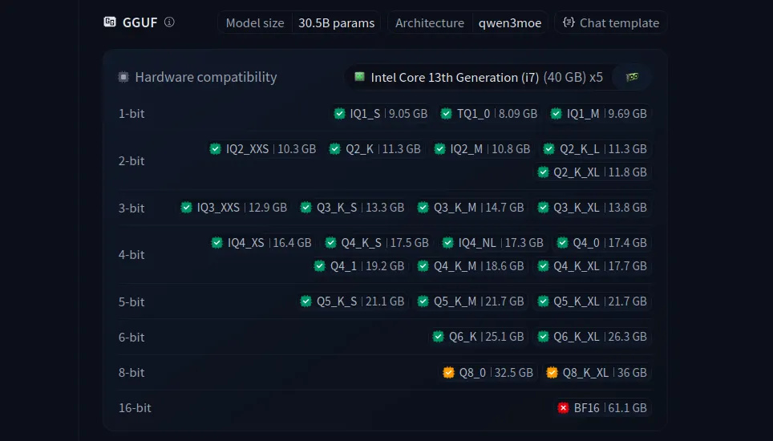

Hugging Face is displaying the available quantization levels for the model that you selected. You will see a green checkmark next to the quantization levels that you can run without any issue on your system.

If you don’t see those icons that means that you did not specify the hardware that you have. Click on your profile picture, then settings.

In the settings page, click on `Local Apps and Hardware`. After that, select one of the three options under the `Add new Hardware` section, select the model that you have and click on the `Add item` button.


But, Imad! I see a lot of quantization options, which one should I choose? That is a great question, before I answer it I would like you to [read this page](https://huggingface.co/docs/hub/gguf#quantization-types) from Hugging Face. There is a table that explains all those quantization types in detail.

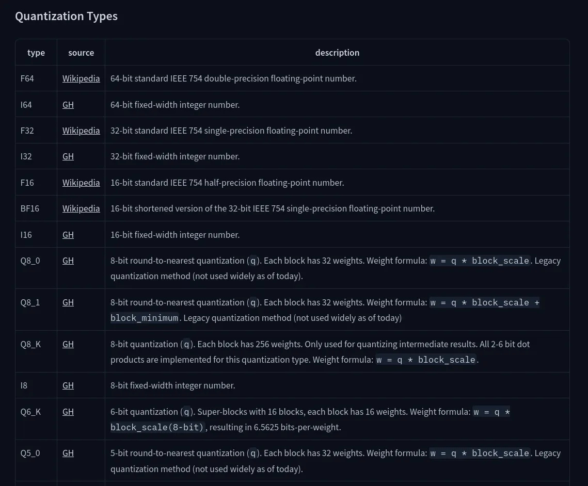

Avoid downloading models in `FP32` or `FP16` precision, as these unquantized formats require a lot of memory, especially for very large models.

Instead, download **quantized** versions of the model in the **GGUF format**, because they use less memory. A great starting point is the `Q8_K` quantization level.

If you encounter an **[Out Of Memory](https://en.wikipedia.org/wiki/Out_of_memory)** **(OOM)** error or the model runs too slowly, try a more aggressive quantization like `Q6_K`. Repeat this process with progressively smaller versions until you find one that runs at a **decent** speed on your machine.

To stay organized, create a dedicated folder for your downloaded models. I will store mine in `~/.cache/llama.cpp/`, but you can use any directory you prefer.

To run a model, use the `llama-cli` command. The following example shows how to run the `Qwen3-30B-A3B-Thinking-2507-IQ4_XS` model with custom settings that I modified.

```bash
llama-cli \
  --model ~/.cache/llama.cpp/Qwen3-30B-A3B-Thinking-2507-IQ4_XS.gguf \
  --n-gpu-layers 20 \
  --ctx-size 4096 \
  --color \
  --interactive-first
```

This command uses several arguments to control the model’s behavior. Here’s an explanation of the arguments that I used:

- `--ctx-size`: Sets the model's context window size in tokens. Larger values can handle longer conversations but require more memory.
- `--n-gpu-layers`: Offloads a specified number of the model's layers to the GPU for acceleration. Adjust this based on your GPU's VRAM.
- `--color`: Adds color to the output to distinguish your input from the model's generation.
- `--interactive-first`: Starts in interactive mode, waiting for user input immediately instead of processing an initial prompt.

For a complete list of all available arguments and their descriptions, run the help command.

```bash
llama-cli --help
```

After running the `llama-cli` command, the program will load the model and display startup information before presenting an interactive prompt. You can then begin chatting with the model directly in your terminal.

```output
$ llama-cli \
  --model ~/.cache/llama.cpp/Qwen3-30B-A3B-Thinking-2507-IQ4_XS.gguf \
  --n-gpu-layers 20 \
  --ctx-size 4096 \
  --color \
  --interactive-first

...

== Running in interactive mode. ==

- Press Ctrl+C to interject at any time.
- Press Return to return control to the AI.
- To return control without starting a new line, end your input with '/'.
- If you want to submit another line, end your input with '\'.
- Not using system message. To change it, set a different value via -sys PROMPT

> Hi
> Hello! 😊 How can I assist you today?

>
```

Before the interactive prompt appears, `llama-cli` outputs detailed logs about the model loading process. If you scroll up through this output, you can verify that the **GPU was detected** and that the 20 layers of the model were successfully offloaded.

First, look for a message confirming `llama.cpp` found your CUDA device.

```output
ggml_cuda_init: found 1 CUDA devices:
  Device 0: NVIDIA GeForce RTX 4070 Laptop GPU, compute capability 8.9, VMM: yes
```

Next, you can see exactly how many of the model’s layers were offloaded to the GPU. In this case, 20 out of 49 layers were moved.

```output
load_tensors: offloading 20 repeating layers to GPU
load_tensors: offloaded 20/49 layers to GPU
```

Finally, the logs provide a breakdown of memory allocation. This is useful for understanding how much **VRAM** and **RAM** the model is using.

```output
print_info: file size = 15.25 GiB (4.29 BPW)

load_tensors:      CUDA0 model buffer size = 6334.71 MiB
load_tensors: CPU_Mapped model buffer size = 9278.95 MiB
```

Based on this output:

- The 20 offloaded layers are occupying **~6.3 GB of GPU VRAM**.
- The rest of the model is running on the CPU and consuming **~9.3 GB of system RAM**.

When you exit the interactive session by pressing `Ctrl+C`, `llama-cli` automatically displays a detailed performance report. The output will look like this.

```output
llama_perf_sampler_print:    sampling time =      25.55 ms /   390 runs   (    0.07 ms per token, 15264.79 tokens per second)
llama_perf_context_print:        load time =   12043.37 ms
llama_perf_context_print: prompt eval time =     444.75 ms /    24 tokens (   18.53 ms per token,    53.96 tokens per second)
llama_perf_context_print:        eval time =   23582.66 ms /   602 runs   (   39.17 ms per token,    25.53 tokens per second)
llama_perf_context_print:       total time =  737557.31 ms /   626 tokens
```

Here is how to interpret the most important metrics from this report:

- `load time`: This is the time it took to load the large model file from your disk into RAM and VRAM. In my case, it took 12 seconds.
- `prompt eval time`: This measures the speed of processing your initial prompt. Here, the speed was `53.96 tokens per second`.
- `eval time`: This is the generation speed, which shows how quickly the model produces new tokens after processing your prompt. In my case, the model generated text at a speed of `25.53 tokens per second`.

## Serving the LLM as an API

Serving a model means running it as a local server, exposing it as an **API** that other applications can connect to and use.

For example, you could write a Python program that uses the model for a specific task or connect a web interface like LibreChat for a more user-friendly chat experience.

To serve the model as an API, we use the `llama-server` program. The command is very similar to `llama-cli`, but with additional arguments for networking.

Here is how you can serve the `Qwen3-30B-A3B-Thinking-2507-IQ4_XS` model.

```bash
llama-server \
  --model ~/.cache/llama.cpp/Qwen3-30B-A3B-Thinking-2507-IQ4_XS.gguf \
  --n-gpu-layers 20 \
  --host 0.0.0.0 \
  --port 8080 \
  --ctx-size 4096
```

In this command we use two networking arguments:

- `--host`: Specifies the IP address the server will listen on.
- `--port`: Specifies the network port the server will use.

Why use `--host 0.0.0.0`?

Setting the host to `0.0.0.0` makes the server listen on all available network interfaces. This is very important for allowing other services, especially applications running inside **Docker containers** (like LibreChat), to see and connect to your `llama-server` instance.

If you were to use the default `127.0.0.1` (localhost), the server would only be accessible from your main computer, and the Docker container would not be able to reach it.

After running the command, the log output will confirm that the server is running and ready to accept requests.

```output
main: server is listening on http://0.0.0.0:8080 - starting the main loop
srv update_slots: all slots are idle
```

### Connect to the server with Python

Since `llama-server` provides an [OpenAI-compatible API](https://github.com/openai/openai-openapi), you can interact with it using the same tools you would use for OpenAI's models. The endpoint for chat is `/v1/chat/completions`.

Let’s write two Python scripts to connect to our server: one for a simple request-response, and a second example for streaming the response in real-time.

#### Example 1: A simple request

In this example, we send a prompt to the server and wait for the full response to be generated before printing it.

- We use [requests](https://github.com/psf/requests) to send the HTTP request and `json` to format our data.
- We create a `messages` list containing `system` and `user` roles. This is sent inside a `data` dictionary, along with other parameters like `temperature`.
- We send a POST request to the server.
- We parse the returned JSON to extract and print the model’s message.

```python
import json

import requests

try:
    messages = [
        {"role": "system", "content": "You are a helpful assistant."},
        {
            "role": "user",
            "content": "Hello! What is the capital of Morocco?",
        },
    ]

    data = {"messages": messages, "temperature": 0.7}
    response = requests.post(
        url="http://localhost:8080/v1/chat/completions",
        headers={
            "Content-Type": "application/json",
        },
        data=json.dumps(data),
    )
    response.raise_for_status()

    response_json = response.json()
    assistant_message = response_json["choices"][0]["message"]["content"]
    print(assistant_message.strip())

except requests.exceptions.RequestException as e:
    print(f"An error occurred: {e}")
```

#### Example 2: Streaming the response

For a real-time experience, you can stream the response token by token. The server uses a standard format called [Server-Sent Events (SSE)](https://html5doctor.com/server-sent-events/). Here’s how it works:

- We add `"stream": True` to our JSON payload and `stream=True` to the `requests.post()` call.
- We use `response.iter_lines()` to process the response as it arrives.
- Each piece of data from the stream is a line of bytes prefixed with `data:`. The code decodes the line, strips the prefix, and parses the remaining string.
- The stream ends when the server sends a final message of `data: [DONE]`. We break out of the loop when we receive that message.
- The generated token is stored inside the **delta** object. We extract this token and print it immediately using `end=""` and `flush=True` to display it on the same line.

```python
import json

import requests

try:
    messages = [
        {"role": "system", "content": "You are a helpful assistant."},
        {
            "role": "user",
            "content": "Hello! What is the capital of Morocco.",
        },
    ]

    data = {
        "messages": messages,
        "temperature": 0.7,
        "stream": True,
    }
    response = requests.post(
        url="http://localhost:8080/v1/chat/completions",
        headers={"Content-Type": "application/json"},
        data=json.dumps(data),
        stream=True,
    )
    response.raise_for_status()

    for line in response.iter_lines():
        if not line:
            continue

        decoded_line = line.decode("utf-8")

        # Each line is prefixed with "data: ", so we strip that
        if decoded_line.startswith("data: "):
            json_string = decoded_line[len("data: ") :]
            if json_string.strip() == "[DONE]":
                break

            try:
                chunk = json.loads(json_string)

                delta_object = chunk["choices"][0]["delta"]
                if "content" in delta_object:
                    token = delta_object["content"]
                    if token:
                        print(token, end="", flush=True)
            except json.JSONDecodeError:
                pass

    print()

except requests.exceptions.RequestException as e:
    print(f"An error occurred: {e}")
```

### Connect to the server with LibreChat

LLMs format their responses in **[Markdown](https://en.wikipedia.org/wiki/Markdown)**. This makes it hard to read the output in the terminal. This is why using web interfaces like **LibreChat** is necessary because they format the output in a way that makes it easier to read.

I love LibreChat because it is highly customizable and can connect to any AI provider, not just our local `llama.cpp` server. It can display the **thinking** process for reasoning models. It supports RAG, storing memories about you, and much more.

Now, let’s configure LibreChat to work with our running `llama-server`. First, clone the LibreChat project and navigate into the new directory.

```bash
git clone https://github.com/danny-avila/LibreChat.git
cd LibreChat
```

Before continuing, make sure that you have [Docker](https://www.docker.com/) installed. Next, create your custom configuration file by copying the example file.

```bash
cp librechat.example.yaml librechat.yaml
```

Now, open the new `librechat.yaml` file. Under the `endpoints.custom` section, add the following entry. This tells LibreChat how to connect to our local `llama.cpp` server.

```yaml
endpoints:
  custom:
    - name: "llama.cpp"
      apiKey: "llama-cpp-is-awesome" # Put anything here. Because we are running the models locally, there is no API key that we need to provide.
      baseURL: "http://host.docker.internal:8080/v1"
      models:
        default: [
            "canis-majoris", # Put any model name here for now. We will change this later.
          ]
        fetch: false
      titleConvo: true
      titleModel: "current_model"
      modelDisplayLabel: "Llama.cpp"
```

The most important setting here is `baseURL`. The address `http://host.docker.internal:8080/v1` allows the LibreChat container to communicate with the `llama-server` running on your main computer. The `apiKey` can be set to anything you like.

Next, create a [Docker compose override file](https://www.librechat.ai/docs/configuration/docker_override). This will tell Docker to use your custom configuration.

```bash
cp docker-compose.override.yml.example docker-compose.override.yml
```

Open the new `docker-compose.override.yml` and uncomment the `services` section. This configuration mounts your `librechat.yaml` file into the container and sets the image for the `api` service to `ghcr.io/danny-avila/librechat:latest`, which pulls the latest stable LibreChat image.

```yaml
# Please consult our docs for more info: https://www.librechat.ai/docs/configuration/docker_override

# TO USE THIS FILE, FIRST UNCOMMENT THE LINE ('services:')

# THEN UNCOMMENT ONLY THE SECTION OR SECTIONS CONTAINING THE CHANGES YOU WANT TO APPLY
# SAVE THIS FILE AS 'docker-compose.override.yaml'
# AND USE THE 'docker compose build' & 'docker compose up -d' COMMANDS AS YOU WOULD NORMALLY DO

# WARNING: YOU CAN ONLY SPECIFY EVERY SERVICE NAME ONCE (api, mongodb, meilisearch, ...)
# IF YOU WANT TO OVERRIDE MULTIPLE SETTINGS IN ONE SERVICE YOU WILL HAVE TO EDIT ACCORDINGLY

# EXAMPLE: if you want to use the config file and the latest numbered release docker image the result will be:

services:
  api:
    volumes:
      - type: bind
        source: ./librechat.yaml
        target: /app/librechat.yaml
    image: ghcr.io/danny-avila/librechat:latest
```

You can now build and run the LibreChat application using Docker compose. Run the following command.

```bash
docker compose up -d
```

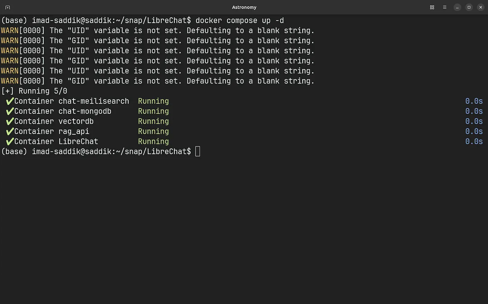

Open your web browser and navigate to [http://localhost:3080](http://localhost:3080). After that, create an account, and login. To select a model that you are serving with `llama-server` follow these steps:

- Click the model selector button in the top-left corner.
- In the dropdown menu, hover over `llama.cpp`.
- Select the model name that appears.

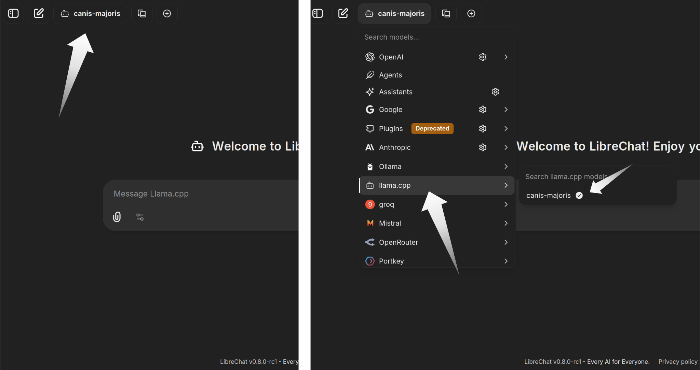

You’ll notice the model is named `canis-majoris`. This is just a display name that I chose, it has nothing to do with the model that you are serving with `llama-server`.

You can now start chatting with your locally hosted model! Don’t forget to run the server first, here is the command.

```bash
llama-server \
  --model ~/.cache/llama.cpp/Qwen3-30B-A3B-Thinking-2507-IQ4_XS.gguf \
  --n-gpu-layers 20 \
  --host 0.0.0.0 \
  --port 8080 \
  --ctx-size 4096
```

### Managing multiple models

Hopefully, you were able to chat with the model. Here is the problem that we will try to solve in this section.

Assume that you have downloaded a GGUF file for another model. If you want to use this new model, you have to stop the old running server and start it again to host the new model.

Doing this manually every time you want to change models is repetitive and not fun at all. We don’t have this issue with ollama, we can download as many models as we like.

Then, we add them to the list of models in `librechat.yaml` and restart the application. We can start a conversation with one model, switch to another and behind the scenes ollama will handle running the models for you.

Luckily, we have [llama-swap](https://github.com/mostlygeek/llama-swap). This tool acts as a smart proxy that sits between LibreChat and `llama.cpp`. When you select a model in the LibreChat UI, `llama-swap` intercepts the request and automatically starts the correct `llama-server` for the model you chose after stopping any other that might be running.

Let’s set up the `llama-swap` tool. Go to the [llama-swap releases page](https://github.com/mostlygeek/llama-swap/releases) and download the archive that matches your operating system and CPU architecture. For example, I chose `llama-swap_162_linux_amd64.tar.gz` because I am on Ubuntu with a 64-bit Intel CPU.


Open your terminal, navigate to your Downloads folder, and extract the `llama-swap` executable using the `tar` command.

```bash
# Make sure to use the exact filename you downloaded
tar -xvzf llama-swap_162_linux_amd64.tar.gz
```

For better organization, create a dedicated folder for `llama-swap` and move the executable into it.

```bash
mkdir ~/llama-swap
mv ~/Downloads/llama-swap ~/llama-swap/
```

`llama-swap` uses a single `config.yaml` file to know which models you have and how to run them.

- Inside your `~/llama-swap` directory, create a new file named `config.yaml`.
- Add your models to the file. For each one, provide a name and the exact `llama-server` command needed to run it.
- `llama-swap` requires you to use `${PORT}` in your command. It will automatically assign a free port when it starts a server.
- The `ttl` value tells `llama-swap` to shut down an inactive model server to free up memory.

Here is an example configuration. Modify it to match the models you have downloaded.

```yaml
models:
  "gemma-3-1b-it":
    cmd: |
      llama-server
      --model /home/imad-saddik/.cache/llama.cpp/ggml-org_gemma-3-1b-it-GGUF_gemma-3-1b-it-Q4_K_M.gguf
      --n-gpu-layers 999
      --ctx-size 8192
      --port ${PORT}
    ttl: 300 # 5 minutes

  "Qwen3-30B-A3B-Thinking":
    cmd: |
      llama-server
      --model /home/imad-saddik/.cache/llama.cpp/Qwen3-30B-A3B-Thinking-2507-IQ4_XS.gguf
      --n-gpu-layers 20
      --ctx-size 4096
      --port ${PORT}
    ttl: 300 # 5 minutes
```

Let’s run the `llama-swap` server. This server will now act as the manager for all your models.

```bash
./llama-swap --listen 0.0.0.0:8080
```

Go back to your `LibreChat` project directory and open `librechat.yaml`. Update the `models.default` list to include the exact names of the models you just defined in `llama-swap`'s `config.yaml`.

```yaml
endpoints:
  custom:
    - name: "llama.cpp"
      apiKey: "llama-cpp-is-awesome"
      baseURL: "http://host.docker.internal:8080/v1"
      models:
        default: [
            # These names MUST EXACTLY match the names in the llama-swap config.yaml
            "gemma-3-1b-it",
            "Qwen3-30B-A3B-Thinking",
          ]
        fetch: false
      titleConvo: true
      titleModel: "current_model"
      modelDisplayLabel: "Llama.cpp"
```

Apply the new configuration by restarting the LibreChat containers.

```bash
docker compose restart
```

Navigate back to LibreChat at [http://localhost:3080](http://localhost:3080). When you click the model selector, you should now see a dropdown list with all the models you configured.

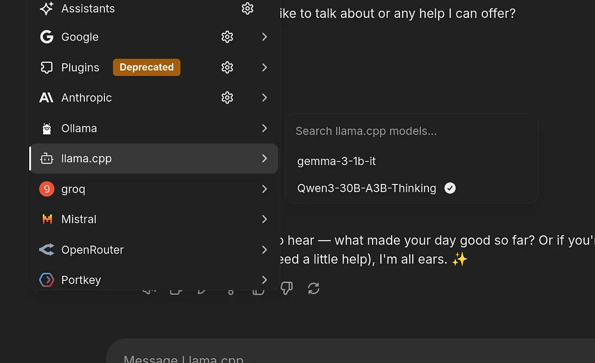

In LibreChat, select one of your models, send a message, and wait for the reply. Open a new browser tab and navigate to the address of your `llama-swap` server: [http://localhost:8080](http://localhost:8080).

This is a web application that ships with `llama-swap`. it shows you logs, available models, the state of each server, and more.

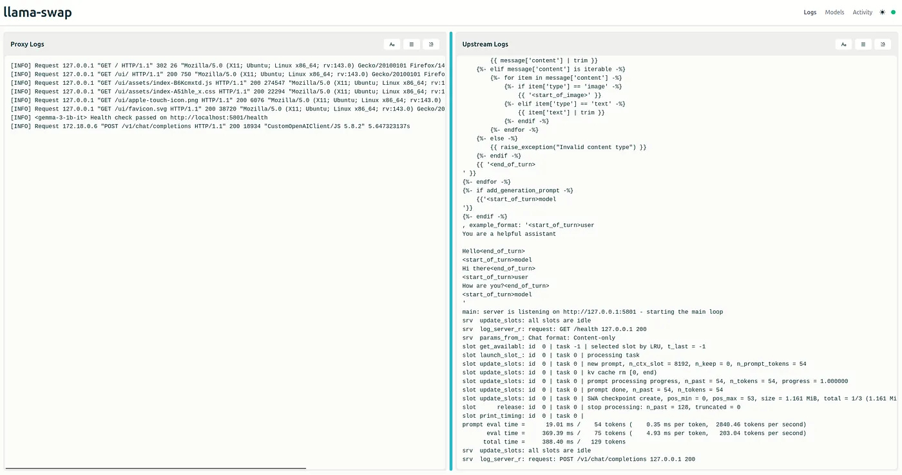

Click on the [models tab](http://localhost:8080/ui/models) and make sure that the model that you are chatting with in LibreChat is in the ready state.


Then, select your second model and send another message. Switch back to the `llama-swap` web interface and notice how the state has changed. The previous model is in the stopped state, while the new one is in the ready state.

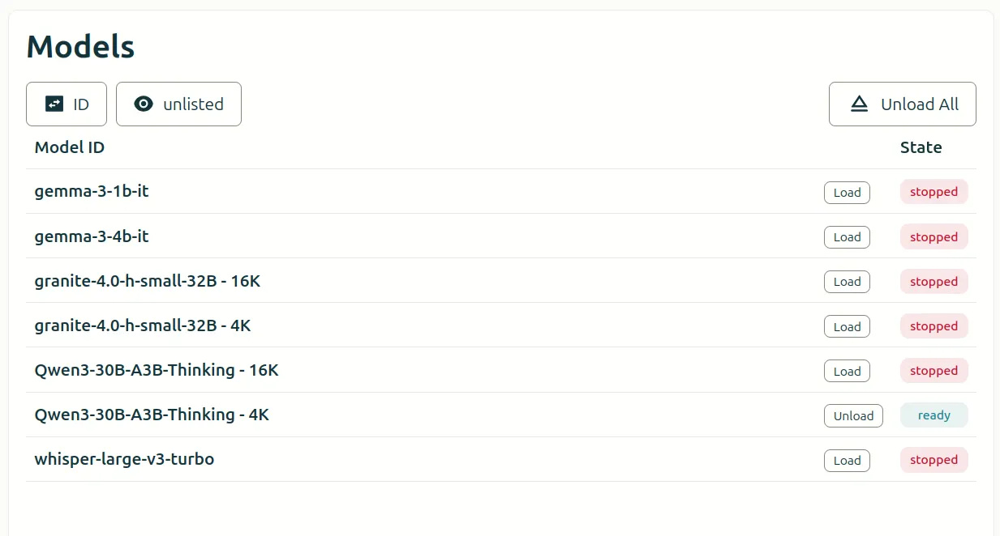

When you switch models in LibreChat, you will see `llama-swap` automatically stop the old server and start the new one. The logs will show a cleanup message like this.

```output
srv    operator(): operator(): cleaning up before exit...
```

If you stop interacting with a model, its status will remain `ready` for the duration you set in the `ttl` field. After that, `llama-swap` will automatically unload it to free up VRAM, and its status will change to `stopped`.

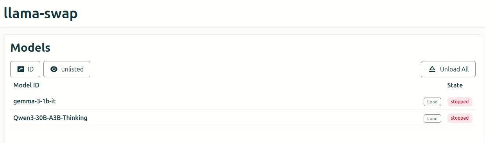

The corresponding log message will look like this.

```output
[INFO] <gemma-3-1b-it> Unloading model, TTL of 300s reached
srv    operator(): operator(): cleaning up before exit...
```

To avoid starting `llama-swap` manually every time you reboot, you can set it up as a `systemd` service that runs automatically in the background. Since `llama-swap` is lightweight and only loads models when needed, it’s fine to keep it running this way.

Create a new service file:

```bash
sudo nano /etc/systemd/system/llama-swap.service
```

Paste the following text into the editor. You **must** replace the placeholder values for `User`, `Group`, and the file paths.

- To find your `User`, run `whoami`.
- To find your `Group`, run `id`. Look for `gid=1000(group_name)`, `group_name` is your group.

```ini
[Unit]
Description=Llama Swap Proxy Server
After=network.target

[Service]
User=your_user # IMPORTANT: Change this
Group=your_group # IMPORTANT: Change this
WorkingDirectory=/home/your_user/llama-swap # IMPORTANT: Change this
ExecStart=/home/your_user/llama-swap/llama-swap --listen 0.0.0.0:8080 # IMPORTANT: Change this
Restart=always
RestartSec=3

[Install]
WantedBy=multi-user.target
```

Save the file, exit the editor, and run these commands to activate and start your new service:

```bash
sudo systemctl daemon-reload
sudo systemctl enable llama-swap
sudo systemctl start llama-swap
```

To view the logs for the running service, you can use the `journalctl` command.

```bash
sudo journalctl -f -u llama-swap.service
```

With this setup, you don’t need to manually stop services to manage memory. `llama-swap` handles it all for you.

Isn’t this awesome? I love llama-swap 🤍

## Working with embedding models

So far, we’ve focused on chat models. Now, let’s explore how to use an **embedding model**, which is designed to convert text into [dense vectors](https://www.pinecone.io/learn/series/nlp/dense-vector-embeddings-nlp/) for tasks like [Retrieval-Augmented Generation](https://en.wikipedia.org/wiki/Retrieval-augmented_generation) (RAG) and [semantic search](https://en.wikipedia.org/wiki/Semantic_search).

We’ll use the [Qwen3-Embedding-8B-Q5_K_M](https://huggingface.co/Qwen/Qwen3-Embedding-8B-GGUF) model, which is currently the top-performing embedding model on the [MTEB leaderboard](https://huggingface.co/spaces/mteb/leaderboard).

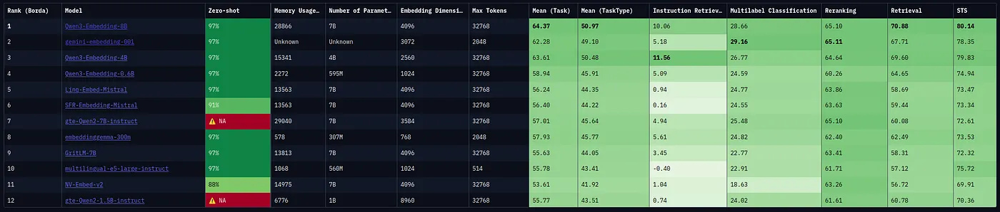

You can generate an embedding directly from the terminal using the `llama-embedding` program.

First, download a GGUF version of the model. I chose the `Q5_K_M` quant because it offers a great balance of quality and performance, allowing me to offload the entire model to my GPU.

Here is the command to generate an embedding for a piece of text:

```bash
llama-embedding \
  --model ~/.cache/llama.cpp/Qwen3-Embedding-8B-Q5_K_M.gguf \
  --n-gpu-layers 999 \
  --pooling last \
  --ubatch-size 1024 \
  --prompt "You like embeddings?"
```

You’ll notice I set `--n-gpu-layers` to `999`. This is a useful trick to tell `llama.cpp` to offload as many layers as possible to the GPU.

If this command gives you an **Out Of Memory (OOM)** error, look at the startup logs for lines that tell you the total number of layers in the model.

```output
load_tensors: offloading 36 repeating layers to GPU
load_tensors: offloading output layer to GPU
load_tensors: offloaded 37/37 layers to GPU
```

This model has 37 layers. If you get an error, reduce the `--n-gpu-layers` value from the total, start with `36` and keep decreasing it until the error disappears. Also, be aware that increasing `--ctx-size` will consume more VRAM.

While the `Qwen3-Embedding-8B` model supports a massive context window of up to **32,768 tokens**, it's more practical to work with smaller text chunks. For a good balance of context and performance, I recommend keeping your chunks between **1024** and **2048** tokens.

### Serving the embedding model as an API

To use the embedding model as a service, run `llama-server` with the `--embedding` flag:

```bash
llama-server \
  --model ~/.cache/llama.cpp/Qwen3-Embedding-8B-Q5_K_M.gguf \
  --n-gpu-layers 999 \
  --ubatch-size 1024 \
  --host 0.0.0.0 \
  --port 8080 \
  --embedding \
  --pooling last
```

This starts a server that exposes the OpenAI-compatible `/v1/embeddings` endpoint.

### Connect to the server with Python

You can get embeddings from the server by sending a POST request. The payload is a JSON object containing the `input` text. The server will respond with the dense vector.

On my system, this request takes only **~30ms** which is really fast!

```python
import json

import requests

try:
    data = {
        "input": "What is the capital of Morocco?",
    }
    response = requests.post(
        url="http://localhost:8080/v1/embeddings",
        headers={
            "Content-Type": "application/json",
        },
        data=json.dumps(data),
    )
    response.raise_for_status()

    response_json = response.json()
    embedding_vector = response_json["data"][0]["embedding"]
    print(f"Size of embedding vector: {len(embedding_vector)}")

except requests.exceptions.RequestException as e:
    print(f"An error occurred: {e}")
```

## Going multimodal

### Working with vision models

So far, we have only worked with text. Now, let’s explore **multimodal models** like [gemma-3-4b-it-GGUF](https://huggingface.co/unsloth/gemma-3-4b-it-GGUF) or [Qwen2.5-VL-3B-Instruct-GGUF](https://huggingface.co/unsloth/Qwen2.5-VL-3B-Instruct-GGUF) that can process and understand both text and images as input.

Running a multimodal model in `llama.cpp` involves two separate files that work together to answer your questions:

- The language model **(**`.gguf`**)**: This is the standard model file we've been using. It understands language, performs reasoning, and generates the final text response.
- The multimodal projector **(**`mmproj.gguf`**)**: This is a specialized model. Its job is to look at an image, process it, and translate what it sees into embeddings that the language model can understand.

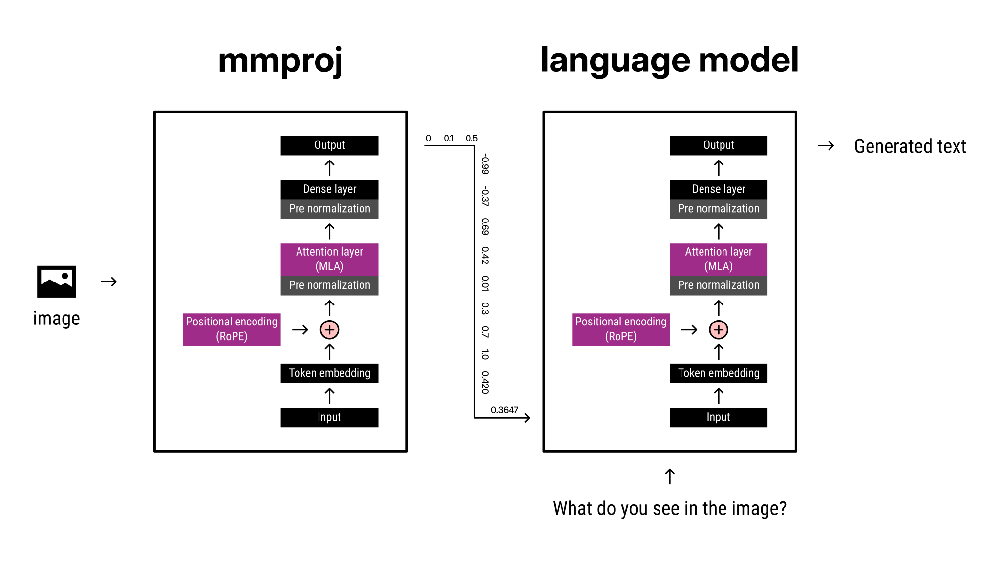

::: info
The diagram above is a conceptual illustration I made to help explain the process. It does not reflect the exact internal architecture of any specific model.
:::

When downloading multimodal models from Hugging Face, you must make sure you get **both** the main `.gguf` file and the corresponding `mmproj.gguf` file.


#### Running the model in the terminal

`llama.cpp` provides a dedicated command-line tool, `llama-mtmd-cli`, for multimodal chat.

First, let’s make the tool easily accessible from anywhere by copying it to a system path.

```bash
sudo cp build/bin/llama-mtmd-cli /usr/local/bin/
```

Now, let’s run the `gemma-3-4b-it-GGUF` model. We can use the `-hf` flag to automatically download the correct model and projector files from Hugging Face.

```bash
llama-mtmd-cli -hf ggml-org/gemma-3-4b-it-GGUF
```

Once the model loads, you'll enter an interactive chat mode.

```output
Running in chat mode, available commands:
/image <path>    load an image
/clear           clear the chat history
/quit or /exit   exit the program
```

First, send a text message to make sure it’s working. Then, use the `/image` command to load your image, followed by a question about it. I will give the model the first thumbnail that I designed for this article.

```output
> /image /home/imad-saddik/Downloads/thumbnail.png
> /home/imad-saddik/Downloads/thumbnail.png image loaded
```

The image is loaded, now let’s ask the model about it.

```output
> What do you see in this image?
encoding image slice...
image slice encoded in 709 ms
decoding image batch 1/1, n_tokens_batch = 256
image decoded (batch 1/1) in 11 ms

Here's a breakdown of what I see in the image:

* **Text:** The main text reads "First experience w/ Llama.cpp". "w/" is a shortened form of "with".
* **C++ Logo:** There's a bright orange logo of a llama with a plus sign (+), representing the C++ programming language.
* **Background:** The background is a gradient, transitioning from white on the left to black on the right.

**Overall Impression:** The image appears to be a graphic related to a beginner's introduction to C++ programming, specifically using the Llama.cpp project (likely a popular tool for running large language models).

>
```

Not bad! The background is solid white rather than a gradient, but hey it worked.

#### Running the model in LibreChat

You can also add your vision model to your `llama-swap` setup to use it within LibreChat's graphical interface.

Add a new entry for the multimodal model in `config.yaml`. The important distinction is that you must include the `--mmproj` flag in the command, pointing to the projector file.

```yaml
models:
  # ... your other models

  "gemma-3-4b-it":
    cmd: |
      llama-server \
      --model /home/imad-saddik/.cache/llama.cpp/ggml-org_gemma-3-4b-it-GGUF_gemma-3-4b-it-Q4_K_M.gguf \
      --mmproj /home/imad-saddik/.cache/llama.cpp/ggml-org_gemma-3-4b-it-GGUF_mmproj-model-f16.gguf \
      --n-gpu-layers 999 \
      --ctx-size 8192 \
      --port ${PORT}
    ttl: 300
```

Apply the changes by restarting the service.

```bash
sudo systemctl restart llama-swap
```

Add the new model name to your LibreChat configuration so it appears in the UI.

```yaml
endpoints:
  custom:
    - name: "llama.cpp"
      apiKey: "llama-cpp-is-awesome"
      baseURL: "http://host.docker.internal:8080/v1"
      models:
        default: [
            # These names MUST EXACTLY match the names in the llama-swap config.yaml
            "gemma-3-1b-it",
            "gemma-3-4b-it", # Add the new model name
            "Qwen3-30B-A3B-Thinking",
          ]
        fetch: false
      titleConvo: true
      titleModel: "current_model"
      modelDisplayLabel: "Canis majoris"
```

Restart LibreChat so that it can load the new configuration.

```bash
docker compose restart
```

In LibreChat, load the `gemma-3-4b-it` model and send a text message to verify that the changes have taken effect.

You got a response back? Perfect. Now click on the attach files icon and upload an image.

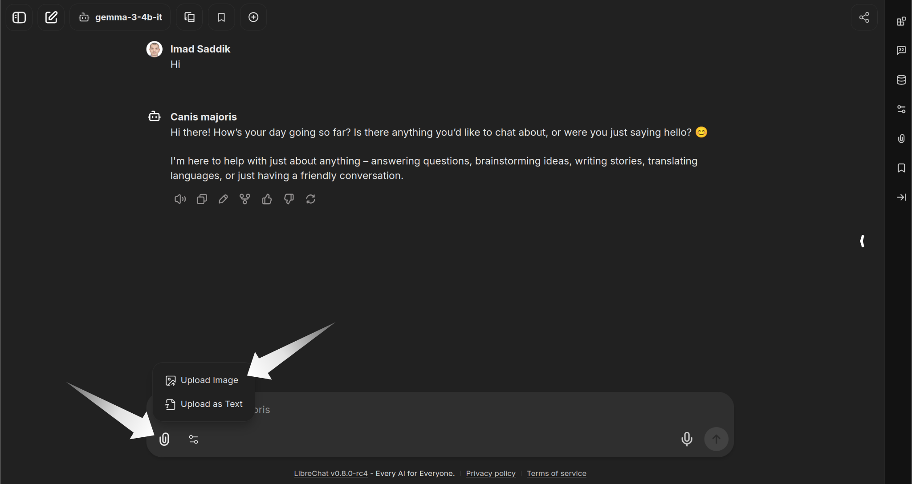

Send the image together with a text message. You should get a response confirming that the model understood the image.


#### Using the model in Python

This time instead of running the `llama-server` command to create a server that the Python script will connect to, we will use the `llama-swap` server since it is already configured to run automatically.

The OpenAI API expects multimodal input in a specific JSON format. The image is not sent as a file but as a [Base64-encoded data URI](https://en.wikipedia.org/wiki/Data_URI_scheme) inside the `messages` payload.

- The `encode_image_to_data_uri` function handles reading the image file and encoding it into this required format.
- The `get_vision_completion` function constructs the special `messages` list containing separate objects for the `text` and the `image_url`. It then sends this payload to `llama-swap`, which routes the request to the correct model.

```python
import base64
import json
import mimetypes

import requests

LLAMA_SWAP_URL = "http://localhost:8080"


def encode_image_to_data_uri(image_path: str) -> str:
    mime_type, _ = mimetypes.guess_type(image_path)
    if mime_type is None:
        mime_type = "application/octet-stream"

    with open(image_path, "rb") as image_file:
        encoded_string = base64.b64encode(image_file.read()).decode("utf-8")

    return f"data:{mime_type};base64,{encoded_string}"


def get_vision_completion(model_name: str, prompt: str, image_path: str) -> None:
    try:
        image_data_uri = encode_image_to_data_uri(image_path)
        messages = [
            {
                "role": "user",
                "content": [
                    {"type": "text", "text": prompt},
                    {"type": "image_url", "image_url": {"url": image_data_uri}},
                ],
            }
        ]

        data = {
            "messages": messages,
            "model": model_name,
            "max_tokens": 1024,
        }
        response = requests.post(
            url=f"{LLAMA_SWAP_URL}/v1/chat/completions",
            headers={"Content-Type": "application/json"},
            data=json.dumps(data),
        )
        response.raise_for_status()
        response_json = response.json()

        assistant_message = response_json["choices"][0]["message"]["content"]
        print(assistant_message.strip())

    except requests.exceptions.RequestException as e:
        print(f"An error occurred: {e}")


model_to_use = "gemma-3-4b-it"  # This tells llama-swap to load the gemma-3-4b-it model
path_to_image = "./thumbnail.png"  # Change the path
text_prompt = "What do you see in the image?"

get_vision_completion(model_to_use, text_prompt, path_to_image)
```

### Working with audio models

Next, we’ll explore models that can understand audio. Audio models come in two main types:

- Models built for specific tasks like [Automatic Speech Recognition](https://developer.nvidia.com/blog/essential-guide-to-automatic-speech-recognition-technology/) (ASR) or [Text-to-Speech](https://www.ibm.com/think/topics/text-to-speech) (TTS).
- General models that combine audio understanding with language to reason about and discuss the content of an audio file.

`llama.cpp` handles the second category of models like [Voxtral-Mini-3B-2507-GGUF](https://huggingface.co/ggml-org/Voxtral-Mini-3B-2507-GGUF) with the same two-file approach we saw with vision models: a main language model and a specialized audio projector.

#### Running the model in the terminal

Let’s use `llama-mtmd-cli` to download and run [Voxtral-Mini-3B-2507-GGUF](https://huggingface.co/ggml-org/Voxtral-Mini-3B-2507-GGUF) for a quick test.

```bash
llama-mtmd-cli -hf ggml-org/Voxtral-Mini-3B-2507-GGUF
```

After it loads, you can use the `/audio` command to provide an audio file and then ask the model to transcribe it. I gave it an audio clip from one of my YouTube videos.

```output
Running in chat mode, available commands:
/audio <path>    load an audio
/clear           clear the chat history
/quit or /exit   exit the program

> /audio /home/imad-saddik/Downloads/audio.mp3
/home/imad-saddik/Downloads/audio.mp3 audio loaded

> Please transcribe the following audio:
encoding audio slice...
audio slice encoded in 248 ms
decoding audio batch 1/1, n_tokens_batch = 187
audio decoded (batch 1/1) in 7 ms
encoding audio slice...
audio slice encoded in 219 ms
decoding audio batch 1/1, n_tokens_batch = 187
audio decoded (batch 1/1) in 3 ms
encoding audio slice...
audio slice encoded in 217 ms
decoding audio batch 1/1, n_tokens_batch = 187
audio decoded (batch 1/1) in 3 ms

Hello everyone, welcome to this course about routing and pathfinding problems. We will focus on using the OSRM project, which stands for Open Source Routing Machine. I will show you how to install the routing engine on your computer and use it as a server to make HTTP requests. You will learn how to use OSRM's services, such as finding the shortest path between two or more points, customizing the profile used by OSRM, it could be cars, bikes, or even pedestrians, solving the traveling salesman problem, and much more. I will also show you how to download a specific map area to limit the search space. In this course, I will use Python in the backend to interact with the OSRM engine server. However, you can use any programming language that makes HTTP requests. We will also visualize the data we get from the engine on a map to make the process more fun and easy to understand. This will help us confirm that the data from OSRM is accurate. I hope you are excited about this course. I will do my best to provide high-quality content. Before we start, the source will be available on GitHub. Let's get started.

>
```

The output is excellent, I am really impressed with this small model.

#### Python and LibreChat integration roadblock

Unfortunately, while `Voxtral` is amazing in the CLI, its advanced audio capabilities are **not yet exposed** through the `llama-server` API.

My attempts to use it with LibreChat or standard OpenAI audio endpoints (like `/v1/audio/transcriptions`) in Python failed with a `404 Not Found` error.

```output
An error occurred: 404 Client Error: Not Found for url: http://localhost:8080/v1/audio/transcriptions
```

I'm sure this will be implemented in the future, but for now, we need to try something else like [whisper.cpp](https://github.com/ggml-org/whisper.cpp) or [faster-whisper](https://github.com/SYSTRAN/faster-whisper).

#### Speech-to-Text with Whisper

Since our goal is to get audio input working in LibreChat, let’s focus on a dedicated Speech-to-Text (STT) model, [Whisper](https://openai.com/index/whisper/).

There are different ways to run Whisper. We can use `whisper.cpp`, `faster-whisper` or other projects.

Clone the `whisper.cpp` project.

```bash
git clone https://github.com/ggml-org/whisper.cpp.git
cd whisper.cpp
```

[Download the model from Hugging Face](https://huggingface.co/ggerganov/whisper.cpp). I picked the large version since it fits comfortably on my GPU.

```bash
wget -O ~/.cache/llama.cpp/whisper-large-v3-turbo-q8_0.gguf "https://huggingface.co/ggerganov/whisper.cpp/resolve/main/ggml-large-v3-turbo-q8_0.bin"
```

I will build the project with CUDA support. Check the project’s [README.md](https://github.com/ggml-org/whisper.cpp/blob/master/README.md) for other options.

```bash
cmake -B build -DGGML_CUDA=1
cmake --build build -j --config Release
```

You should see something like this in the end.

```output
[ 99%] Linking CXX executable ../../bin/whisper-cli
[ 99%] Built target whisper-cli
[100%] Linking CXX executable ../../bin/whisper-server
[100%] Built target whisper-server
```

Copy the programs to `/usr/local/bin`.

```bash
sudo cp build/bin/whisper-server /usr/local/bin/
sudo cp build/bin/whisper-cli /usr/local/bin/
```

Now, let’s add our new `whisper-server` to `llama-swap`'s configuration. Add the following entry.

```yaml
models:
  ...
  "whisper-large-v3-turbo":
    cmd: |
      whisper-server
      --model /home/imad-saddik/.cache/llama.cpp/whisper-large-v3-turbo-q8_0.gguf
      --port ${PORT}
      --host 0.0.0.0
      --request-path /v1/audio/transcriptions
      --inference-path ""
    checkEndpoint: /v1/audio/transcriptions/
    ttl: 300
```

The `--request-path` tells `whisper-server` which API endpoint to use. Now, restart the service.

```bash
sudo systemctl restart llama-swap
```

Before trying LibreChat, let’s confirm the API is working with a Python script. This script sends a local audio file to our server.

```python
import requests

try:
    audio_file_path = "./audio.mp3"
    with open(audio_file_path, "rb") as audio_file:
        files = {"file": (audio_file_path.split("/")[-1], audio_file, "audio/mp3")}

        response = requests.post(
            url="http://localhost:8080/v1/audio/transcriptions",
            data={"model": "whisper-large-v3-turbo"},
            files=files,
        )
        response.raise_for_status()

    response_json = response.json()
    transcribed_text = response_json["text"]
    print(transcribed_text.strip())

except requests.exceptions.RequestException as e:
    print(f"An error occurred: {e}")
except FileNotFoundError:
    print("Error: The file was not found")
```

Running this script should successfully return the full transcribed text, proving our `whisper.cpp` server and `llama-swap` integration is working correctly. Here is the output:

```output
Hello everyone, welcome to this course about routing and pathfinding problems. We will focus on using the OSRM project, which stands for Open Source Routing Machine. I will show you how to install the routing engine on your computer and use it as a server to make HTTP requests. You will learn how to use the OSRM's services, such as finding the shortest path between two or more points, customizing the profile used by OSRM. It could be cars, bikes, or even pedestrians, solving the traveling salesman problem, and much more. I will also show you how to download a specific map area to limit the search space. In this course, I will use Python in the backend to interact with the OSRM engine server. However, you can use any programming language that can make HTTP requests. We will also visualize the data we get from the engine on a map to make the process more fun and easy to understand. This will help us confirm that the data from OSRM is accurate. I hope you are excited about this course. I will do my best to provide high quality content. Before I forget, the source code will be available on GitHub. Let's get started.
```

To get the timestamps, use this code instead. It tells the `whisper-server` to give us detailed data from the model. This is achieved by adding `response_format` and `timestamp_granularities` to the payload.

```python
import datetime

import requests

try:
    audio_file_path = "./audio.mp3"
    with open(audio_file_path, "rb") as audio_file:
        files = {"file": (audio_file_path.split("/")[-1], audio_file, "audio/mp3")}

        response = requests.post(
            url="http://localhost:8080/v1/audio/transcriptions",
            data={
                "model": "whisper-large-v3-turbo",
                "response_format": "verbose_json",
                "timestamp_granularities": ["segment"],
            },
            files=files,
        )
        response.raise_for_status()

    response_json = response.json()
    for segment in response_json["segments"]:
        start_time_seconds = segment["start"]
        end_time_seconds = segment["end"]
        text = segment["text"]

        start_timestamp = str(datetime.timedelta(seconds=start_time_seconds))
        end_timestamp = str(datetime.timedelta(seconds=end_time_seconds))

        print(f"[{start_timestamp} --> {end_timestamp}] {text.strip()}")

except requests.exceptions.RequestException as e:
    print(f"An error occurred: {e}")
except FileNotFoundError:
    print("Error: The file was not found.")
```

Here is the output of the script.

```output
[0:00:00 --> 0:00:04.240000] Hello, everyone. Welcome to this course about routing and
[0:00:04.240000 --> 0:00:09.560000] pathfinding problems. We will focus on using the OSRM
[0:00:09.560000 --> 0:00:14.170000] project, which stands for Open Source Routing Machine. I
[0:00:14.170000 --> 0:00:17.520000] will show you how to install the routing engine on
[0:00:17.520000 --> 0:00:22.640000] your computer and use it as a server to make HTTP requests.
[0:00:22.640000 --> 0:00:26.080000] You will learn how to use the OSRM's services,
[0:00:26.080000 --> 0:00:29.740000] such as finding the shortest path between two or more
[0:00:29.740000 --> 0:00:33.600000] points, customizing the profile used by OSRM.
[0:00:33.600000 --> 0:00:38.340000] It could be cars, bikes, or even pedestrians, solving the
[0:00:38.340000 --> 0:00:42.720000] traveling salesman problem, and much more. I will also
[0:00:42.720000 --> 0:00:47.450000] show you how to download a specific map area to limit the
[0:00:47.450000 --> 0:00:51.760000] search space. In this course, I will use Python
[0:00:51.760000 --> 0:00:56.010000] in the backend to interact with the OSRM engine server.
[0:00:56.010000 --> 0:00:59.600000] However, you can use any programming language
[0:00:59.600000 --> 0:01:03.940000] that can make HTTP requests. We will also visualize the
[0:01:03.940000 --> 0:01:07.360000] data we get from the engine on a map to make the
[0:01:07.360000 --> 0:01:11.970000] process more fun and easy to understand. This will help us
[0:01:11.970000 --> 0:01:15.280000] confirm that the data from OSRM is accurate.
[0:01:15.280000 --> 0:01:18.790000] I hope you are excited about this course. I will do my best
[0:01:18.790000 --> 0:01:21.440000] to provide high quality content. Before I
[0:01:21.440000 --> 0:01:24.940000] forget, the source code will be available on GitHub. Let's
[0:01:24.940000 --> 0:01:25.680000] get started.
```

Now, let’s use whisper in LibreChat. Open `librechat.yaml` and update the `speech` section.

```yaml
speech:
  speechTab:
    speechToText:
      engineSTT: "external"
  stt:
    openai:
      url: "http://host.docker.internal:8080/v1/audio/transcriptions"
      apiKey: "whisper-cpp-is-awesome"
      model: "whisper-large-v3-turbo" # The same name in config.yaml
```

Restart the LibreChat containers.

```bash
docker compose restart
```

Click on the **Settings** button.


Click on the **Speech** option, and make sure that the engine is set to `External` in the Speech to Text section.

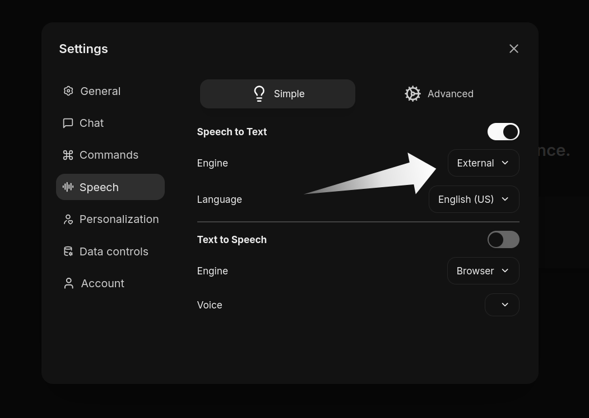

Go back and click on the microphone and start talking, when you are done click the button again to stop the recording. LibreChat will call the transcriptions endpoint and will send the data to whisper.

Go to the `llama-swap` dashboard, you should see that whisper is starting to load.

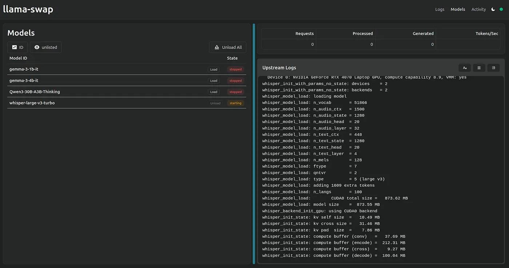

After waiting for a few seconds, I got this error.


Looking at the `llama-swap` logs reveals the problem.

```output
error: failed to read audio data as wav (Unknown error)
error: failed to read audio data
```

The issue is an **audio format incompatibility**. LibreChat’s browser interface sends audio in `webm` format, but the default `whisper-server` expects `16-bit WAV`.

There is a section in the [README.md](https://github.com/ggml-org/whisper.cpp?tab=readme-ov-file#ffmpeg-support-linux-only) file that shows how to compile `whisper.cpp` with [ffmpeg](https://github.com/FFmpeg/FFmpeg) so that the program can handle different audio formats.

I followed those instructions but couldn’t solve the problem. Instead, I ran into new issues. The `whisper-cli` works fine with different audio files, but the `whisper-server` isn’t functioning properly. I get errors like these.

```output
Couldn't open input file Eߣ
error: failed to ffmpeg decode 'Eߣ'
error: failed to read audio data

Couldn't open input file ID3
error: failed to ffmpeg decode 'ID3'
error: failed to read audio data
```

Hopefully, this issue will be fixed soon. I didn’t want to wait, so I found another project called [faster-whisper](https://github.com/SYSTRAN/faster-whisper). It’s similar to `whisper.cpp` but faster, and it can be installed as a Python package.

Let’s create a dedicated Python environment to keep our dependencies clean.

```bash
# Using Conda
conda create -n faster_whisper python=3.12 -y
conda activate faster_whisper

# Or using Python's venv
python -m venv .faster_whisper
source .faster_whisper/bin/activate
```

Install `faster-whisper` and other libraries that we will use to create a server in Python.

```bash
pip install faster-whisper
pip install fastapi "uvicorn[standard]" python-multipart
```

To run the model on a GPU, follow the [instructions in the](https://github.com/SYSTRAN/faster-whisper?tab=readme-ov-file#gpu) README. You’ll need to install `cuBLAS` and `cuDNN`, either system-wide or inside a virtual environment.

I chose to install them in a virtual environment, which makes it easier to remove them later if needed. You can install `cuBLAS` and `cuDNN` with the following command.

```bash
pip install nvidia-cublas-cu12 "nvidia-cudnn-cu12==9.*"
```

You must tell your system where to find the NVIDIA libraries you just installed by setting the `LD_LIBRARY_PATH` environment variable. If you don’t do that, you will get this error.

```output
Unable to load any of {libcudnn_ops.so.9.1.0, libcudnn_ops.so.9.1, libcudnn_ops.so.9, libcudnn_ops.so}
Invalid handle. Cannot load symbol cudnnCreateTensorDescriptor
Aborted (core dumped)
```

Run these commands in the terminal to fix the error.

```bash
CONDA_ENV_PATH="/home/imad-saddik/anaconda3/envs/faster_whisper" # IMPORTANT: Change this
SITE_PACKAGES_PATH="$CONDA_ENV_PATH/lib/python3.12/site-packages" # IMPORTANT: Change this

export LD_LIBRARY_PATH="$SITE_PACKAGES_PATH/nvidia/cudnn/lib:$SITE_PACKAGES_PATH/nvidia/cublas/lib""
```

I will use the `large-v3` model. If you can’t run it, change the model name to a smaller version.

In the `WhisperModel` class, I’m using `cuda` as the device and `int8_float16` as the compute type. If you don’t have a GPU, set the device to CPU like this.

```python
model = WhisperModel(model_size, device="cpu", compute_type="int8")
```

After that, pass the audio to the `transcribe` method. It returns a generator, which allows you to loop through the segments as they are produced.

```python
from faster_whisper import WhisperModel

try:
    model_size = "large-v3"
    model = WhisperModel(model_size, device="cuda", compute_type="int8_float16")

    segments, info = model.transcribe("./audio.mp3", beam_size=5)
    print(
        "Detected language '%s' with probability %f"
        % (info.language, info.language_probability)
    )

    for segment in segments:
        print("[%.2fs -> %.2fs] %s" % (segment.start, segment.end, segment.text))

except Exception as e:
    print("Error during transcription:", str(e))
```

If you were able to run this code without any issue, you can create the `FastAPI` server. Start by creating an instance of the `FastAPI` class and adding a `/health` endpoint. This endpoint is important because `llama-swap` will use it to check whether the server is alive.

```python
from fastapi import FastAPI

app = FastAPI()

@app.get("/health")
async def health_check():
    return {"status": "ok"}
```

Next, set up logging and load the model at startup so it can be reused for every request.

```python
import logging

from fastapi import FastAPI
from faster_whisper import WhisperModel

logging.basicConfig()
logger = logging.getLogger(__name__)
logging.getLogger("faster_whisper").setLevel(logging.INFO)

logger.info("Loading the Whisper model")
whisper_model = WhisperModel(
    model_size_or_path="large-v3",
    device="cuda",
    compute_type="float16"
)
logger.info("Whisper model loaded successfully.")

app = FastAPI()

@app.get("/health")
async def health_check():
    return {"status": "ok"}
```

Finally, add the `/v1/audio/transcriptions` endpoint. In the `transcribe_audio` method, a temporary file is created with the audio data received from LibreChat. The file is then passed to the `transcribe` method, the segments are combined, and the final text is returned to the frontend.

```python
import logging
import os
import tempfile

from fastapi import FastAPI, File, Form, UploadFile
from faster_whisper import WhisperModel

logging.basicConfig()
logger = logging.getLogger(__name__)
logging.getLogger("faster_whisper").setLevel(logging.INFO)

logger.info("Loading the Whisper model")
whisper_model = WhisperModel(
    model_size_or_path="large-v3", device="cuda", compute_type="float16"
)
logger.info("Whisper model loaded successfully.")

app = FastAPI()


@app.get("/health")
async def health_check():
    return {"status": "ok"}


@app.post("/v1/audio/transcriptions")
async def transcribe_audio(
    file: UploadFile = File(...),
    model: str = Form(...),
):
    logger.info(f"Received request for model: {model}")

    with tempfile.NamedTemporaryFile(delete=False, suffix=".tmp") as tmp_file:
        tmp_file.write(await file.read())
        tmp_file_path = tmp_file.name

    logger.info(f"Transcribing audio file: {file.filename}")
    segments, info = whisper_model.transcribe(tmp_file_path, beam_size=5)
    full_text = "".join(segment.text for segment in segments)
    os.unlink(tmp_file_path)
    logger.info(f"Transcription successful. Detected language: {info.language}")

    return {"text": full_text.strip()}
```

Now we’ll tell `llama-swap` how to manage our new FastAPI server. Create a bash script.

```bash
nano start.sh
```

This script sets the required environment variable and then starts the [uvicorn](https://github.com/Kludex/uvicorn) server, passing along the port assigned by `llama-swap`.

```bash
#!/bin/bash

PROJECT_DIR="/home/imad-saddik/Programs/faster-whisper"
CONDA_ENV_PATH="/home/imad-saddik/anaconda3/envs/faster_whisper"
SITE_PACKAGES_PATH="$CONDA_ENV_PATH/lib/python3.12/site-packages"

export LD_LIBRARY_PATH="$SITE_PACKAGES_PATH/nvidia/cudnn/lib:$SITE_PACKAGES_PATH/nvidia/cublas/lib"

cd "$PROJECT_DIR"
"$CONDA_ENV_PATH/bin/uvicorn" server:app --host 0.0.0.0 "$@"
```

Make the script executable.

```bash
chmod +x start.sh
```

Next, we need to update the `config.yaml` file. We will configure `llama-swap` to:

- Run our bash script (`start.sh`).
- Check the `/health` endpoint to verify that the FastAPI server is running.
- After 300 seconds, use `pkill` to stop the FastAPI server.

```yaml
models:
  ...
  "whisper-large-v3-turbo":
    cmd: /home/imad-saddik/Programs/faster-whisper/start.sh --port ${PORT}
    cmdStop: pkill -f "uvicorn server:app"
    proxy: http://127.0.0.1:${PORT}
    checkEndpoint: "/health"
    ttl: 300
```

Restart the `llama-swap` service.

```bash
sudo systemctl restart llama-swap
```

In LibreChat, click the microphone icon to start recording, speak, and click it again to stop. The icon will show a loading state while the FastAPI server starts.

Open the `llama-swap` interface.

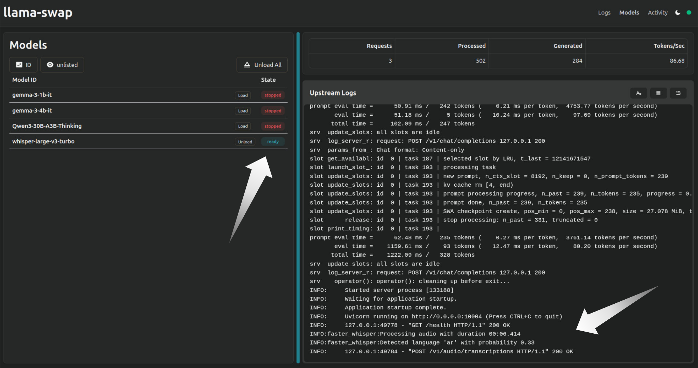

You should see that the model is in a **ready state**, and if you inspect the logs, you will see entries like the following.

```output
INFO: Started server process [133188]
INFO: Waiting for application startup.
INFO: Application startup complete.
INFO: Uvicorn running on http://0.0.0.0:10004 (Press CTRL+C to quit)
INFO: 127.0.0.1:49778 - "GET /health HTTP/1.1" 200 OK
INFO:faster_whisper:Processing audio with duration 00:06.414
INFO:faster_whisper:Detected language 'ar' with probability 0.33
INFO: 127.0.0.1:49784 - "POST /v1/audio/transcriptions HTTP/1.1" 200 OK
```

I have to admit, I spent a lot of time on this feature, so I’m really happy that it worked in the end.

## Optimizing performance with llama-bench

Manually tweaking arguments like `--n-gpu-layers` and `--ctx-size` to find the best performance for your hardware is not fun. `llama.cpp` includes a tool called `llama-bench` that automates this process by running a series of benchmarks and presenting the results in a clear table.

Make the tool easily accessible from your terminal.

```bash
sudo cp build/bin/llama-bench /usr/local/bin/
```

You can run `llama-bench -h` to see all available options. Read the [README.md](https://github.com/ggml-org/llama.cpp/blob/master/tools/llama-bench/README.md) to find examples of how to use the tool.

### Find the optimal number of GPU layers

Our first goal is to find the number of GPU layers that gives the highest generation speed (tokens/second) without using all available VRAM.

Let's benchmark the `Qwen3-30B-A3B-Thinking` model across a range of GPU layer counts.

```bash
llama-bench \
  --model ~/.cache/llama.cpp/Qwen3-30B-A3B-Thinking-2507-IQ4_XS.gguf \
  --n-gen 128 \
  --n-prompt 0 \
  --n-gpu-layers 18-24+1
```

The argument `--n-gpu-layers 18-24+1` tells `llama-bench` to start with 18 layers and increase the count by 1 up to 24. In each run, the model will generate 128 tokens.

| model                              | size (GiB) | params (B) | backend | ngl | test  | t/s          |
| :--------------------------------- | :--------- | :--------- | :------ | :-- | :---- | :----------- |
| qwen3moe 30B.A3B IQ4_XS - 4.25 bpw | 15.25      | 30.53      | CUDA    | 18  | tg128 | 25.22 ± 0.57 |
| qwen3moe 30B.A3B IQ4_XS - 4.25 bpw | 15.25      | 30.53      | CUDA    | 19  | tg128 | 25.46 ± 0.49 |
| qwen3moe 30B.A3B IQ4_XS - 4.25 bpw | 15.25      | 30.53      | CUDA    | 20  | tg128 | 25.22 ± 0.93 |
| qwen3moe 30B.A3B IQ4_XS - 4.25 bpw | 15.25      | 30.53      | CUDA    | 21  | tg128 | 23.92 ± 1.15 |
| qwen3moe 30B.A3B IQ4_XS - 4.25 bpw | 15.25      | 30.53      | CUDA    | 22  | tg128 | 23.70 ± 1.37 |
| qwen3moe 30B.A3B IQ4_XS - 4.25 bpw | 15.25      | 30.53      | CUDA    | 23  | tg128 | 24.85 ± 0.94 |

The table shows that offloading **19 layers** provides the highest generation speed. We can also see the final run for 24 layers failed due to insufficient VRAM.

```output
main: error: failed to create context with model '/home/imad-saddik/.cache/llama.cpp/Qwen3-30B-A3B-Thinking-2507-IQ4_XS.gguf'
```

### Determine maximum context size and speed trade-offs

Now that we know our optimal speed is at 19 GPU layers, let’s see how performance changes as the context window fills up. We can use the `--n-depth` argument to benchmark the model at different context depths.

This simulates how it would perform with a pre-existing conversation history of `0`, `4096`, `8192`, and `16384` tokens.

```bash
llama-bench \
  --model ~/.cache/llama.cpp/Qwen3-30B-A3B-Thinking-2507-IQ4_XS.gguf \
  --n-gen 128 \
  --n-prompt 0 \
  --n-gpu-layers 19 \
  --n-depth 0,4096,8192,16384
```

| model                              | size (GiB) | params (B) | backend | ngl | test          | t/s          |
| :--------------------------------- | :--------- | :--------- | :------ | :-- | :------------ | :----------- |
| qwen3moe 30B.A3B IQ4_XS - 4.25 bpw | 15.25      | 30.53      | CUDA    | 19  | tg128         | 22.12 ± 2.12 |
| qwen3moe 30B.A3B IQ4_XS - 4.25 bpw | 15.25      | 30.53      | CUDA    | 19  | tg128 @ d4096 | 15.60 ± 0.26 |
| qwen3moe 30B.A3B IQ4_XS - 4.25 bpw | 15.25      | 30.53      | CUDA    | 19  | tg128 @ d8192 | 11.33 ± 0.35 |

The results show a clear trade-off. With 19 layers on the GPU, we don’t have enough leftover VRAM to handle a 16,384 token context. To support a larger context, we must sacrifice some speed by offloading fewer layers. Let’s test that hypothesis by reducing the layers to 16.

```bash
llama-bench \
  --model ~/.cache/llama.cpp/Qwen3-30B-A3B-Thinking-2507-IQ4_XS.gguf \
  --n-gen 128 \
  --n-prompt 0 \
  --n-gpu-layers 16 \
  --n-depth 0,4096,8192,16384
```

| model                              | size (GiB) | params (B) | backend | ngl | test           | t/s          |
| :--------------------------------- | :--------- | :--------- | :------ | :-- | :------------- | :----------- |
| qwen3moe 30B.A3B IQ4_XS - 4.25 bpw | 15.25      | 30.53      | CUDA    | 16  | tg128          | 23.14 ± 1.04 |
| qwen3moe 30B.A3B IQ4_XS - 4.25 bpw | 15.25      | 30.53      | CUDA    | 16  | tg128 @ d4096  | 14.62 ± 0.17 |
| qwen3moe 30B.A3B IQ4_XS - 4.25 bpw | 15.25      | 30.53      | CUDA    | 16  | tg128 @ d8192  | 10.63 ± 0.12 |
| qwen3moe 30B.A3B IQ4_XS - 4.25 bpw | 15.25      | 30.53      | CUDA    | 16  | tg128 @ d16384 | 6.79 ± 0.10  |

By offloading only 16 layers, we can now handle the 16K context window. Notice how the generation speed decreases when the context window increases. This is normal because the model needs to do a lot of work.

For most tasks, you won’t need a large context window. But if you plan to upload long documents, the window can fill up quickly. To avoid manually changing arguments each time, create two entries in `config.yaml`: one for small tasks, and another for tasks requiring a large context window.

```yaml
models:
  "Qwen3-30B-A3B-Thinking - 4K":
    cmd: |
      llama-server
      --model /home/imad-saddik/.cache/llama.cpp/Qwen3-30B-A3B-Thinking-2507-IQ4_XS.gguf
      --n-gpu-layers 19
      --ctx-size 4096
      --port ${PORT}
    ttl: 300

  "Qwen3-30B-A3B-Thinking - 16K":
    cmd: |
      llama-server
      --model /home/imad-saddik/.cache/llama.cpp/Qwen3-30B-A3B-Thinking-2507-IQ4_XS.gguf
      --n-gpu-layers 16
      --ctx-size 16384
      --port ${PORT}
    ttl: 300
```

Restart the `llama-swap` service.

```bash
sudo systemctl restart llama-swap
```

Update the `librechat.yaml` file to include the new models.

```yaml
endpoints:
  custom:
    - name: "llama.cpp"
      apiKey: "llama-cpp-is-awesome"
      baseURL: "http://host.docker.internal:8080/v1"
      models:
        default: [
            # These names MUST EXACTLY match the names in the llama-swap config.yaml
            "gemma-3-1b-it",
            "gemma-3-4b-it",
            "Qwen3-30B-A3B-Thinking - 4K",
            "Qwen3-30B-A3B-Thinking - 16K",
          ]
        fetch: false
      titleConvo: true
      titleModel: "current_model"
      modelDisplayLabel: "Canis majoris"
```

Finally, restart LibreChat.

```bash
docker compose restart
```

This is how you can use `llama-bench` to systematically find the best settings for your hardware. For more examples, please read the [README.md](https://github.com/ggml-org/llama.cpp/blob/master/tools/llama-bench/README.md) file.

## Automating the entire workflow

### Creating desktop shortcuts for easy access

To make launching everything easier, we’ll be accessing two web interfaces:

- **llama-swap interface**: [http://localhost:8080/](http://localhost:8080/)
- **LibreChat**: [http://localhost:3080/](http://localhost:3080/)

Instead of remembering these links, we can create desktop shortcuts to open these links.

#### llama-swap

Create a new launcher file in your local applications directory.

```bash
nano ~/.local/share/applications/llama-swap.desktop
```

Paste the following into the editor. This defines the launcher’s name, action, and icon. **Remember to change the** `Icon` **path** to where you saved the icon. You can [download the icon from here](https://github.com/mostlygeek/llama-swap/blob/main/ui/public/favicon.svg).

```ini
[Desktop Entry]
Version=1.0
Type=Application
Name=Llama Swap UI
Comment=Monitor local llama.cpp models
Exec=xdg-open http://localhost:8080/
Icon=/path/to/icon.svg # IMPORTANT: Change this path
Terminal=false
Categories=Network;
```

Make the file executable.

```bash
chmod +x ~/.local/share/applications/llama-swap.desktop
```

Run the following command to make your new shortcut discoverable by your system’s application menu.

```bash
update-desktop-database ~/.local/share/applications
```

Search for **Llama Swap UI**. You should see it appear in the search result. Click it and verify that it opens the browser with the correct link.


#### LibreChat

Create another launcher file in your local applications directory.

```bash
nano ~/.local/share/applications/librechat.desktop
```

Paste the following into the editor. **Remember to change the** `Exec` **and** `Icon` **paths**. You can [download the icon from here](https://github.com/danny-avila/LibreChat/blob/main/client/public/assets/logo.svg).

```ini
[Desktop Entry]
Version=1.0
Name=LibreChat
Comment=Run LibreChat with Docker
Exec=/path/to/LibreChat/start.sh # IMPORTANT: Change this path
Icon=/path/to/logo.svg # IMPORTANT: Change this path
Terminal=false
Type=Application
Categories=Utility;Development;
```

Make the file executable.

```bash
chmod +x ~/.local/share/applications/librechat.desktop
```

Navigate to your `LibreChat` project directory and create a new script file.

```bash
nano start.sh
```

This script will automatically navigate to the correct directory, run `docker compose up -d`, and launch Firefox. **Remember to change the** `DOCKER_COMPOSE_DIR` **path**.

```bash
#!/bin/bash

DOCKER_COMPOSE_DIR="/path/to/LibreChat/" # IMPORTANT: Change this path
cd "$DOCKER_COMPOSE_DIR"
docker compose up -d
firefox http://localhost:3080
```

Search for **LibreChat** in your application menu and click it. It should start the Docker containers (if they aren’t already running) and open the UI in your browser.


### Automatically restarting services on configuration changes

So far, we have to manually restart `llama-swap` or `LibreChat` every time we edit their `.yaml` configuration files. This is repetitive and easy to forget. We can do better by creating a fully automated workflow that watches for changes and triggers restarts for us.

We will rely on [inotify-tools](https://github.com/inotify-tools/inotify-tools) for this automation. This is a powerful Linux utility that can monitor files for events like modifications.

On Ubuntu, you can install `inotify-tools` like so.

```bash
sudo apt update
sudo apt install inotify-tools
```

First, we’ll create a bash script that will contain the logic for watching the files and triggering the restarts.

```bash
sudo nano /usr/local/bin/config_watcher.sh
```

Paste the following code into the file.

```bash
#!/bin/bash

# IMPORTANT: UPDATE THESE PATHS
LLAMA_SWAP_CONFIG="/home/imad-saddik/Programs/llama-swap/config.yaml"
LIBRECHAT_CONFIG="/home/imad-saddik/snap/LibreChat/librechat.yaml"
LIBRECHAT_DIR="/home/imad-saddik/snap/LibreChat/"

while true; do
  # Wait for a modification event on either file.
  # The --format '%w%f' prints the full path of the modified file.
  MODIFIED_FILE=$(inotifywait -q -e modify --format '%w%f' "$LLAMA_SWAP_CONFIG" "$LIBRECHAT_CONFIG")

  if [ "$MODIFIED_FILE" == "$LLAMA_SWAP_CONFIG" ]; then
    echo "$(date): Change detected in $LLAMA_SWAP_CONFIG. Restarting all services..."
    sudo systemctl restart llama-swap
    (cd "$LIBRECHAT_DIR" && docker compose restart)
    echo "$(date): All services restarted successfully."

  elif [ "$MODIFIED_FILE" == "$LIBRECHAT_CONFIG" ]; then
    echo "$(date): Change detected in $LIBRECHAT_CONFIG. Restarting LibreChat containers..."
    (cd "$LIBRECHAT_DIR" && docker compose restart)
    echo "$(date): LibreChat containers restarted successfully."
  fi
done
```

I begin the script by creating variables to improve code readability. Make sure to update the paths to the `config.yaml` file, the `librechat.yaml` file, and the LibreChat folder containing the source code.

Next, I use an infinite loop to continuously monitor these files. The following line of code pauses execution and waits for any signal indicating that a file has changed.

```bash
MODIFIED_FILE=$(inotifywait -q -e modify --format '%w%f' "$LLAMA_SWAP_CONFIG" "$LIBRECHAT_CONFIG")
```

We use the `inotifywait` command to monitor the two files: `config.yaml` and `librechat.yaml`. The file paths are provided at the end of the command as `$LLAMA_SWAP_CONFIG` and `$LIBRECHAT_CONFIG`.

I included the `-q` option so that `inotifywait` runs quietly without printing any output, and the `-e modify` option to listen specifically for modifications. This event is triggered whenever a file is saved.

The `--format '%w%f'` option tells `inotifywait` to output the full path of the file that was changed. This path is then stored in the `MODIFIED_FILE` variable.

Once we have the path of the modified file, we check whether it is `config.yaml` or `librechat.yaml`. Inside the corresponding `if-else` blocks, we execute the commands that we previously ran manually.

```bash
sudo systemctl restart llama-swap
docker compose restart
```

Now, the script handles them automatically for us.

Notice something: to restart the `llama-swap` service, we need to use `sudo`. This is a problem because the script will pause and wait for a password.

Fortunately, we can create a rule that allows this script to run without requiring a password. To do this, open the `sudoers` file for editing using `visudo`. It’s important to use `visudo` because it checks for syntax errors before saving.

```bash
sudo visudo
```

Scroll to the bottom of the file and add the following line.

```output
imad-saddik ALL=(ALL) NOPASSWD: /usr/bin/systemctl restart llama-swap
```

Here’s what each part means:

- `imad-saddik` is the user who gets the permission. The rule applies to this user only.
- `ALL=(ALL)` has two parts: the first `ALL=` means the rule applies to the current machine, and `(ALL)` means the command can be run as any user, granting root privileges.
- `NOPASSWD` tells the system that when `imad-saddik` runs the `/usr/bin/systemctl restart llama-swap` command, no password is required. Without this, the script would stop every time it tried to run `sudo`, waiting for a password.
- `/usr/bin/systemctl restart llama-swap` is the exact command that `imad-saddik` is allowed to run without a password. No other commands are affected.

Save the file and exit. Next, make the script executable.

```bash
sudo chmod +x /usr/local/bin/config_watcher.sh
```

Now, create a systemd service to run the script automatically.

```bash
sudo nano /etc/systemd/system/config-watcher.service
```

Copy and paste the following configuration. This tells systemd to run the script under your user account.

```ini
[Unit]
Description=Watcher for llama-swap and librechat config files
After=network.target

[Service]
User=imad-saddik
Group=imad-saddik
ExecStart=/usr/local/bin/config_watcher.sh
Restart=always

[Install]
WantedBy=multi-user.target
```

Enable and start the service.

```bash
sudo systemctl daemon-reload
sudo systemctl enable config-watcher.service
sudo systemctl start config-watcher.service
```

Check the status to make sure it is running correctly.

```bash
sudo systemctl status config-watcher.service
```

```output
● config-watcher.service - Watcher for llama-swap and librechat config files
     Loaded: loaded (/etc/systemd/system/config-watcher.service; enabled; preset: enabled)
     Active: active (running) since Wed 2025-10-01 21:19:38 +01; 2h 26min ago
   Main PID: 23025 (config_watcher.)
      Tasks: 2 (limit: 37817)
     Memory: 1.7M (peak: 24.3M)
        CPU: 140ms
     CGroup: /system.slice/config-watcher.service
             ├─23025 /bin/bash /usr/local/bin/config_watcher.sh
             └─28014 inotifywait -q -e modify --format %w%f /home/imad-saddik/Programs/llama-swap/config.yaml /home/i>
```

This confirms that your script is now running as a background service and will automatically watch for changes to the configuration files.

Now, make a change in `config.yaml` and save it. For example, remove a model from the list. In my case, I removed `Qwen3-30B-A3B-Thinking - 16K`:

```yaml
models:
  "gemma-3-1b-it":
    cmd: |
      llama-server
      --model /home/imad-saddik/.cache/llama.cpp/ggml-org_gemma-3-1b-it-GGUF_gemma-3-1b-it-Q4_K_M.gguf
      --n-gpu-layers 999
      --ctx-size 8192
      --port ${PORT}
    ttl: 300

  "Qwen3-30B-A3B-Thinking - 4K":
    cmd: |
      llama-server
      --model /home/imad-saddik/.cache/llama.cpp/Qwen3-30B-A3B-Thinking-2507-IQ4_XS.gguf
      --n-gpu-layers 19
      --ctx-size 4096
      --port ${PORT}
    ttl: 300

  # "Qwen3-30B-A3B-Thinking - 16K":
  #   cmd: |
  #     llama-server
  #     --model /home/imad-saddik/.cache/llama.cpp/Qwen3-30B-A3B-Thinking-2507-IQ4_XS.gguf
  #     --n-gpu-layers 16
  #     --ctx-size 16384
  #     --port ${PORT}
  #   ttl: 300

  "gemma-3-4b-it":
    cmd: |
      llama-server
      --model /home/imad-saddik/.cache/llama.cpp/ggml-org_gemma-3-4b-it-GGUF_gemma-3-4b-it-Q4_K_M.gguf
      --mmproj /home/imad-saddik/.cache/llama.cpp/ggml-org_gemma-3-4b-it-GGUF_mmproj-model-f16.gguf
      --n-gpu-layers 999
      --ctx-size 8192
      --port ${PORT}
    ttl: 300

  "whisper-large-v3-turbo":
    cmd: /home/imad-saddik/Programs/faster-whisper/start.sh --port ${PORT}
    cmdStop: pkill -f "uvicorn server:app"
    proxy: http://127.0.0.1:${PORT}
    checkEndpoint: "/health"
    ttl: 300
```

To watch the logs in real time, run.

```bash
journalctl -u config-watcher.service -f
```

You should see that the change is detected, for example.

```output
$ journalctl -u config-watcher.service -f
Oct 01 21:19:38 saddik systemd[1]: Started config-watcher.service - Watcher for llama-swap and librechat config files.
Oct 01 21:20:47 saddik config_watcher.sh[23025]: Wed Oct 1 09:20:47 PM +01 2025: **Change detected** in /home/imad-saddik/Programs/llama-swap/config.yaml. Restarting all services...
Oct 01 21:20:47 saddik sudo[23945]: imad-saddik : PWD=/ ; USER=root ; COMMAND=/usr/bin/systemctl restart llama-swap
```

To verify that it worked, open the `llama-swap` interface and confirm that the removed model no longer appears. In this example, `Qwen3-30B-A3B-Thinking - 16K` is gone.

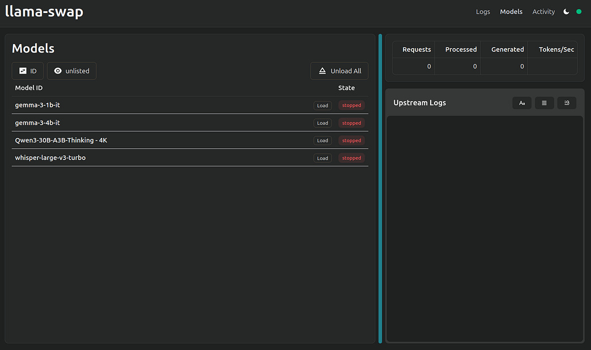

Next, do the same with `librechat.yaml` by updating the list of models.

```yaml
endpoints:
  custom:
    - name: "llama.cpp"
      apiKey: "llama-cpp-is-awesome"
      baseURL: "http://host.docker.internal:3647/v1"
      models:
        default: [
            # These names MUST EXACTLY match the names in the llama-swap config.yaml
            "gemma-3-1b-it",
            "gemma-3-4b-it",
            "Qwen3-30B-A3B-Thinking - 4K",
            # "Qwen3-30B-A3B-Thinking - 16K",
          ]
```

Save the file and watch the logs again. You should see something like.

```output
Oct 01 21:21:39 saddik config_watcher.sh[23025]: Wed Oct 1 09:21:39 PM +01 2025: **Change detected** in /home/imad-saddik/snap/LibreChat/librechat.yaml. Restarting LibreChat containers...
```

Open LibreChat and check the model list, `Qwen3-30B-A3B-Thinking - 16K` is no longer available.

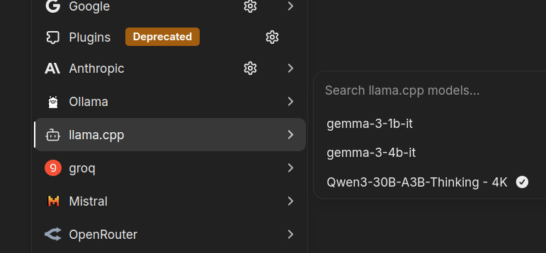

Now you can enjoy watching the script automatically restart the services whenever you make changes. This feature saves time and makes sure you never forget to restart anything. I really like it, and I hope you do too!

## Keep things up-to-date

The projects we are using are actively developed. It is a good idea to update them from time to time to get the latest features, bug fixes, and performance improvements.

### Llama.cpp

The `llama.cpp` project moves very quickly. Here is how you can update it manually.

First, navigate to your `llama.cpp` project directory.

```bash
cd /path/to/llama.cpp
```

Pull the latest changes from the GitHub repository.

```bash
git pull --rebase
```

Next, remove the old `build` directory to make sure you perform a clean compilation.

```bash
rm -rf build/
```

Now, recompile the project using the same commands you used during the initial installation. Remember to use the correct flags for your hardware (e.g., `GGML_CUDA=ON` for NVIDIA GPUs).

```bash
cmake -B build -DGGML_CUDA=ON -DCMAKE_CUDA_ARCHITECTURES=89
cmake --build build --config Release -j $(nproc)
```

Finally, copy the newly compiled programs to `/usr/local/bin`, replacing the old versions.

```bash
sudo cp build/bin/llama-cli /usr/local/bin/
sudo cp build/bin/llama-server /usr/local/bin/
sudo cp build/bin/llama-embedding /usr/local/bin/
sudo cp build/bin/llama-mtmd-cli /usr/local/bin/
sudo cp build/bin/llama-bench /usr/local/bin/
```

That was the manual approach. Now, let’s look at how to automate these steps so they run periodically. You can automate this process using a [cron job](https://en.wikipedia.org/wiki/Cron).

First, create a shell script that contains all the update commands.

```bash
sudo nano /usr/local/bin/update_llama_cpp.sh
```

Paste the following code into the script. **Make sure to change the** `LLAMA_CPP_DIR` **path** to the correct location on your system.

```bash
#!/bin/bash

LLAMA_CPP_DIR="/path/to/your/llama.cpp" # IMPORTANT: Change this path
cd "$LLAMA_CPP_DIR" || exit

git pull --rebase

rm -rf build/

cmake -B build -DGGML_CUDA=ON -DCMAKE_CUDA_ARCHITECTURES=89
cmake --build build --config Release -j $(nproc)

cp build/bin/llama-cli /usr/local/bin/
cp build/bin/llama-server /usr/local/bin/
cp build/bin/llama-embedding /usr/local/bin/
cp build/bin/llama-mtmd-cli /usr/local/bin/
cp build/bin/llama-bench /usr/local/bin/

echo "llama.cpp updated successfully on $(date)"
```

Make the script executable.

```bash
sudo chmod +x /usr/local/bin/update_llama_cpp.sh
```

Open your crontab file for editing.

```bash
crontab -e
```

Add the following line to the end of the file. This will run your update script **every day at 6:00 AM**.

```output
0 6 * * * sudo /home/your_user/update_llama_cpp.sh >> /home/your_user/llama_cpp_update.log 2>&1
```

Let me explain this line:

- `0 6 * * *`: This is the schedule. It means "at minute 0 of hour 6, every day, every month, every day of the week."
- `/home/your_user/update_llama_cpp.sh`: This is the command to run. **Make sure to use the full path to your script**.
- `>> /home/your_user/llama_cpp_update.log 2>&1`: This part redirects the output of the script to a log file.

Save and close the file. Now your `llama.cpp` installation will be updated automatically every day.

Open the `sudoers` file.

```bash
sudo visudo
```

Scroll to the bottom and add the following line to allow the script to run without requiring a password.

```output
imad-saddik ALL=(ALL) NOPASSWD: /usr/bin/systemctl restart llama-swap
```

I ran into a few issues with **crontab**. Sometimes it executed my job, and other times it didn’t, even though my laptop was powered on at the scheduled time. To avoid dealing with inconsistent behavior, I switched to **anacron**.

Anacron works differently from crontab. Instead of running a job at a specific hour, it only guarantees when the job should run: daily, weekly, monthly, and so on. If the system was off at the scheduled time, anacron will simply run the job the next time the machine is on. This is exactly what I needed.

Since I want to update **llama.cpp** every day, I placed the update script directly inside the `/etc/cron.daily/` directory. Files inside this directory are executed once per day by anacron. Create the script as follows (without a file extension).

```bash
sudo nano /etc/cron.daily/update-llama-cpp
```

Now, paste this entire content into the editor.

```bash
#!/bin/bash

LOG_DIR="/home/your_user/Programs/logs/llama.cpp"
LOG_FILE="$LOG_DIR/llama_cpp_update_$(date +%Y-%m-%d).log"
mkdir -p "$LOG_DIR"

# This line redirects all output for the rest of the script
exec >> "$LOG_FILE" 2>&1

echo "--- Starting llama.cpp daily update at $(date) ---"
LLAMA_CPP_DIR="/home/your_user/Programs/llama.cpp"
if [ ! -d "$LLAMA_CPP_DIR" ]; then
    echo "Error: Directory $LLAMA_CPP_DIR does not exist."
    exit 1
fi

cd "$LLAMA_CPP_DIR" || exit

echo "Running git pull..."
git pull --rebase

echo "Cleaning build directory..."
rm -rf build/

echo "Running cmake setup..."
cmake -B build -DGGML_CUDA=ON -DCMAKE_CUDA_ARCHITECTURES=89

echo "Building project (using $(nproc) cores)..."
cmake --build build --config Release -j $(nproc)

echo "Copying new binaries to /usr/local/bin/..."
cp build/bin/llama-cli /usr/local/bin/
cp build/bin/llama-server /usr/local/bin/
cp build/bin/llama-embedding /usr/local/bin/
cp build/bin/llama-mtmd-cli /usr/local/bin/
cp build/bin/llama-bench /usr/local/bin/

echo "--- llama.cpp updated successfully on $(date) ---"
exit 0
```

Save the file and make it executable.

```bash
sudo chmod +x /etc/cron.daily/update-llama-cpp
```

At this point, the old crontab entry is no longer needed. Open your crontab and delete the line you previously added.

```bash
crontab -e
```

Anacron will automatically detect and run your new script during its next daily check. If you want to test it immediately, run it manually.

```bash
sudo /etc/cron.daily/update-llama-cpp
```

Then inspect the log file to confirm everything worked.

```bash
cat /home/imad-saddik/Programs/logs/llama.cpp/llama_cpp_update_$(date +%Y-%m-%d).log
```

Finally, the old script located at `/usr/local/bin/update_llama_cpp.sh` is no longer used by anything, so you can safely remove it.

```bash
sudo rm /usr/local/bin/update_llama_cpp.sh
```

This guarantees that llama.cpp stays up-to-date every day without relying on crontab’s unpredictable behavior.

### llama-swap

To update `llama-swap`, visit the [releases page](https://github.com/mostlygeek/llama-swap/releases) on GitHub. Download the latest archive for your system, e.g. `llama-swap_XXX_linux_amd64.tar.gz`.

Extract the archive and replace your old `llama-swap` executable with the new one.

```bash
tar -xvzf llama-swap_XXX_linux_amd64.tar.gz
sudo mv llama-swap /path/to/your/old/llama-swap
```

### LibreChat

Updating LibreChat involves pulling the latest changes from GitHub and rebuilding the Docker containers.

First, navigate to your LibreChat directory.

```bash
cd /path/to/LibreChat
```

Pull the latest code changes from GitHub.

```bash
git pull --rebase
```

Stop and remove the current Docker containers.

```bash
docker compose down
```

Remove the old Docker images to free up space.

```bash
# For Linux/Mac
docker images -a | grep "librechat" | awk '{print $3}' | xargs docker rmi
```

Now, pull the new application images that the updated configuration files refer to.

```bash
docker compose pull
```

Finally, start the application again in detached mode.

```bash
docker compose up -d
```

### whisper.cpp

The update process for `whisper.cpp` is the same as for `llama.cpp`.

Navigate to the `whisper.cpp` directory.

```bash
cd /path/to/whisper.cpp
```

Pull the latest changes and recompile the project.

```bash
git pull --rebase
rm -rf build/
cmake -B build -DGGML_CUDA=1
cmake --build build -j --config Release
```

Copy the updated programs to your system path.

```bash
sudo cp build/bin/whisper-server /usr/local/bin/
sudo cp build/bin/whisper-cli /usr/local/bin/
```

### faster-whisper

Since `faster-whisper` was installed as a Python package, updating it is simple.

First, activate the Python environment you used for the installation.

```bash
# For Conda
conda activate faster_whisper

# For venv
source .faster_whisper/bin/activate
```

Then, use `pip` to upgrade the package to the latest version.

```bash
pip install --upgrade faster-whisper
```

## Conclusion


This article documented my complete journey of replacing ollama with a more powerful, flexible, and fully-controlled local AI stack. We started with the goal of running large models that ollama couldn’t handle and ended up building a complete system centered around `llama.cpp` and `llama-swap`.

We covered every step in detail, from building `llama.cpp` from source with **CUDA** support to serving large language models, embedding models, and multimodal models that can understand both images and audio. We integrated everything with **LibreChat**, providing a flexible interface that makes it easy to interact with our models.

An essential component of this process was `llama-swap`, which acted as an intelligent manager for our models. It automatically handles loading and unloading them on demand, which frees up VRAM and makes switching between different models seamless. When we faced challenges with audio input in LibreChat, we built a custom `faster-whisper` server to solve the audio format incompatibility.

Beyond just running models, we focused on optimization and automation. We used `llama-bench` to fine-tune performance for our specific hardware and created specialized configurations for different context window sizes. We automated the entire workflow by creating `systemd` services to run everything in the background, desktop shortcuts for easy access, and a file watcher that automatically restarts services whenever we change a configuration file.

What I ended up with is a setup that gives me full control over the entire stack. It’s a powerful, efficient, and customized system that has transformed how I interact with local models. I am extremely satisfied with this new environment and hope this guide helps you to build your own.

## Updates

### Solving the whisper audio format issue

After publishing this article, I received a comment from a reader named [Gtinjr](https://medium.com/u/66a72706c889) on Medium. They pointed out that I gave up on `whisper.cpp` too early!

In the **Speech-to-Text with Whisper** section, I mentioned that I couldn’t get the native `whisper-server` to work with LibreChat because of audio format incompatibilities (WebM vs WAV). I resorted to building a custom Python server using `faster-whisper` to bridge that gap.

It turns out I was missing two things: enabling FFmpeg during the build process AND using the `--convert` flag when running the server.

::: info
This FFmpeg integration is currently supported on **Linux only**.
:::

If you prefer to use the native `whisper.cpp` server instead of the Python workaround, here is how to do it.

You need these libraries so `whisper.cpp` can link against them during compilation.

```bash
sudo apt install libavcodec-dev libavformat-dev libavutil-dev
```

Navigate to your `whisper.cpp` directory. You need to add `-DWHISPER_FFMPEG=yes` to your cmake command.

::: warning
In the command below, I am using `-DCMAKE_CUDA_ARCHITECTURES=89` which targets my specific GPU (RTX 4070). You must change this number to match your GPU's [compute capability](https://developer.nvidia.com/cuda/gpus) (e.g., `86` for RTX 3000 series, `75` for RTX 2000 series), or use `native` to let CMake detect it automatically.
:::

```bash
cd ~/Programs/whisper.cpp
rm -rf build/

# Build with CUDA and FFmpeg support
cmake -B build -DGGML_CUDA=1 -DWHISPER_FFMPEG=yes -DCMAKE_CUDA_ARCHITECTURES=89
cmake --build build -j --config Release
```

Now you don’t need the Python script or the virtual environment anymore. You can run the native server directly.

Open your `llama-swap/config.yaml` and update the whisper entry. The key change here is adding the `--convert` flag, which tells the server to automatically convert incoming audio (like WebM from LibreChat) into the WAV format it needs.

```yaml
"whisper-large-v3-turbo":
  cmd: |
    whisper-server
    --model /home/imad-saddik/.cache/llama.cpp/whisper-large-v3-turbo-q8_0.gguf
    --port ${PORT}
    --host 0.0.0.0
    --convert # <--- The flag that fixes the issue!
  checkEndpoint: /health
  ttl: 300
```

Restart llama-swap.

```bash
sudo systemctl restart llama-swap
```

Now, when you speak into LibreChat, `whisper-server` will accept the audio, convert it internally using FFmpeg, and return the transcription.

This solution is much cleaner because it removes the need for the external Python environment and the `faster-whisper` dependency. A huge thank you to [Gtinjr](https://medium.com/u/66a72706c889) for sharing this solution!

#### Optional: Cleanup old faster-whisper files

If you previously followed the `faster-whisper` instructions, you can now safely remove the old files to free up space.

Start by removing the Python project.

```bash
rm -rf ~/Programs/faster-whisper
```

Next, remove the Python environment.

```bash
# If you used Anaconda
conda env remove -n faster_whisper

# If you used venv
rm -rf ~/.faster_whisper
```

Most importantly, don’t forget to delete the cached model weights, as `faster-whisper` stores them separately from `llama.cpp` models.

```bash
rm -rf ~/.cache/huggingface/hub/models--Systran--faster-whisper-large-v3
```

### llama.cpp: New built-in WebUI

Recently, `llama.cpp` [released a major update](https://github.com/ggml-org/llama.cpp/discussions/16938) that includes a new, modern WebUI built with [SvelteKit](https://svelte.dev/). It is a fully featured interface that runs directly from the `llama-server` binary without any extra installation.

Some of the nice features include:

- **Multimodal support:** You can upload images for vision models.
- **Document processing:** You can upload text files and even PDFs directly into the chat context.
- **Parallel conversations:** You can run multiple chat streams at the same time.
- **Math rendering:** It supports LaTeX for rendering mathematical expressions.

For a full list of features and videos on how to use them, check out the [official discussion on GitHub](https://github.com/ggml-org/llama.cpp/discussions/16938).

To use it, you need to run `llama-server` directly. I recommend adding the `--jinja` flag, which enables the Jinja2 template engine to handle chat templates more accurately.

```bash
llama-server \
  --model ~/.cache/llama.cpp/Qwen3-30B-A3B-Thinking-2507-IQ4_XS.gguf \
  --port 8033 \
  --n-gpu-layers 19 \
  --ctx-size 4096 \
  --host 0.0.0.0 \
  --jinja
```

Now, navigate to [http://localhost:8033](http://localhost:8033) in your browser.

::: video ./33_llama_cpp_web_ui.mp4 "The new llama.cpp WebUI."
:::
